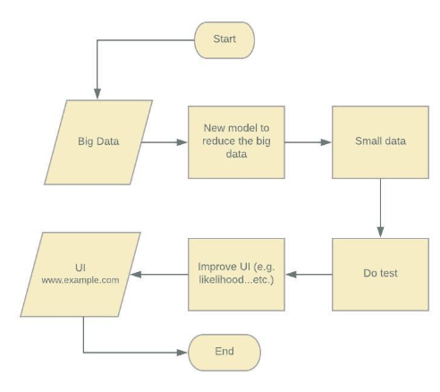
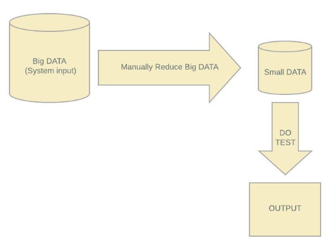
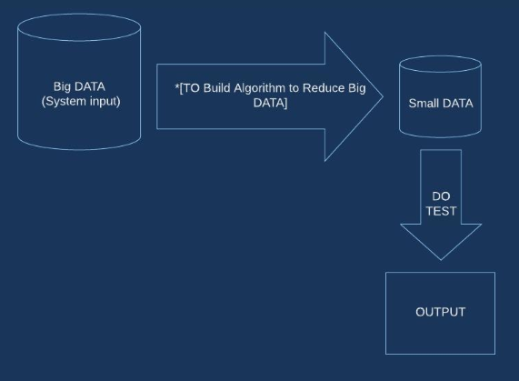
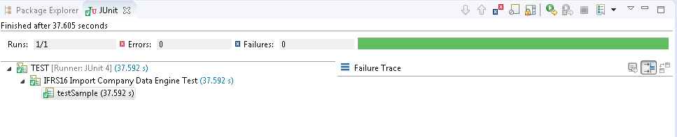
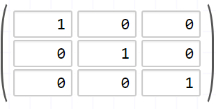

# Würth Phoenix Briefings by Heider and Opaniyi

# Briefing 1 
with [Würth Phoenix Software Developer](https://www.wuerth-phoenix.com/en/career/details/?tx_news_pi1%5Bnews%5D=18&cHash=33f680a22deeef4d54f87ead46374752), The New Model for [UI’s](https://en.wikipedia.org/wiki/User_interface) input and the [Likelihood’](https://en.wikipedia.org/wiki/Maximum_likelihood_estimation) Problems. This document is a briefing for a discussion happened between AYO's Team and the [Würth Phoenix Software Developers](https://www.wuerth-phoenix.com/en/career/details/?tx_news_pi1%5Bnews%5D=18&cHash=33f680a22deeef4d54f87ead46374752) developer.

## New Model


[Würth Phoenix Software Developer](https://www.wuerth-phoenix.com/en/career/details/?tx_news_pi1%5Bnews%5D=18&cHash=33f680a22deeef4d54f87ead46374752) first reduced the UI input manually, then they performed some tests, and after the tests are done they checked the likelihood to improve the UI. 
Now, the question is: Is it possible to build a new model to reduce the UI’s input automatically? 
 

 
 
  
## New Model and Likelihood Parameters


Knowing that answer to the above question, the [Würth Phoenix Software Developer](https://www.wuerth-phoenix.com/en/career/details/?tx_news_pi1%5Bnews%5D=18&cHash=33f680a22deeef4d54f87ead46374752) 
can use the [likelihood parameter](https://en.wikipedia.org/wiki/Maximum_likelihood_estimation) to improve the UI.


* If the answer of Q1 was __Yes__ (e.g. Yes, it is possible to build a new model to reduce the UI’s input) then the second question will be the following:
* Is the new model suitable to the likelihood parameter, 
* and if the answer is __No__ then is it possible to provide new parameters for the new model or not?


# Briefing 2


## Problem

Würth Phoenix in ASIS form The [Würth Phoenix Software Developer](https://www.wuerth-phoenix.com/en/career/details/?tx_news_pi1%5Bnews%5D=18&cHash=33f680a22deeef4d54f87ead46374752) reduced the [big data](https://link.springer.com/article/10.1007/s41019-016-0022-0) manually.




## Würth Phoenix in TOBE form:

 The company wants to build an algorithm to reduce the [big data](https://link.springer.com/article/10.1007/s41019-016-0022-0).





# Briefing 3

## Test

 This test is the one that the Würth Phoenix company needs to develop.

## Check Method

Würth Phoenix have to implement a function to combine the columns; in order tp reduce the data, and when the data reduced the Würth Phoenix run the test.

## Combination
 Würth Phoenix combines all valid combination, for each combination they checked the data.

## The adapted classes
 The Würth Phoenix do not allow an individual to access the database.

## Goal

The students have to find a way to check the functionality and the database without accessing the database.


#  Würth Phoenix labs: 11th May 2018 & 18th May 2018
## JUnit test




## Java Console


# Würth Phoenix lab 25th May 2018 
## Create Combination 
```ruby
We create (combination) for the typelist where some are (valid) and others are (not valid) and (conbinationline)
```

## File names and locations

### SampleEngineTestData

```ruby
C:\Users\Dell XPS 15\git\AYO\example2\src\com\wuerth\phoenix\cis\university\example2\test\sample\SampleEngineTestData.java
```


```ruby
public ArrayList<Company> createCompanyList() {
		
		ArrayList<Company> companyList = new ArrayList<>();
		
		for(String code : COMPANY_CODES) {
		
			Company company = new Company();
			company.setCode(code);
			companyList.add(company);
			
			for(CompanyType companyType : new CompanyType[] {CompanyType.PRODUCTIVE, CompanyType.CONSOLIDATED}) {
			
				ImplementedCompany implementedCompany = new ImplementedCompany();
				implementedCompany.setType(companyType);
				company.createChildImplementedCompany(implementedCompany);
			}
		}
	
```


## EngineTestData

```ruby
C:\Users\Dell XPS 15\git\AYO\example2\src\com\wuerth\phoenix\cis\university\example2\test\ayo\EngineTestData.java
```

```ruby	
	private boolean[][] createCombinations(int size) {
		int count = Double.valueOf(Math.pow(2,size)).intValue();
		boolean[][] map = new boolean[count][size];
		for(int columnIndex=0; columnIndex<size; columnIndex++) {
			int module = Double.valueOf(Math.pow(2,columnIndex)).intValue();
			boolean value = false;
			for(int index=0; index<count; index++) {
				map[index][columnIndex] = value;
				if((index+1) % module == 0) {
					value = !value;
```

### Create Matrix
```ruby
 * we create matrix for the combination type 
 * The matrix is with Boolean values: (0,1)
```


## Create Example adapter

From the matrix that we created we will select all the (1) values and we will ignore all the (0) values. (i.g See image):



__We will choose cell with value 1, therefor we will have these cells:__

[x] cell(1,1), cell(2,2) and cell(3,3) (see image)


# Würth Phoenix lab 2018 May 25th


```ruby
getTag(): consider 'C:\phxrepository\cis_dev\dev\bin\.'
getTag(): consider 'C:\phxrepository\cis_dev\dev\bin'
getTag(): consider 'C:\phxrepository\cis_dev\dev'
getTag(): consider 'C:\phxrepository\cis_dev'
getTag(): consider 'C:\phxrepository'
getTag(): consider 'C:\'
getTag(): 'UNKNOWN' found!
Using org.netbeans.jemmy.drivers.DefaultDriverInstaller driver installer
2018-05-25 11:27:45.462|getResource|File './data/TASKS.xml' found as 'file:/C:/phxrepository/cis_dev/test/classes/com/wuerth/phoenix/cis/test/menubar/data/TASKS.xml'|OutputChecker.log (enabled)
2018-05-25 11:28:01.514|getResource|File '/com/wuerth/phoenix/cis/images/note_view.png' found as 'file:/C:/phxrepository/cis_dev/dev/classes/com/wuerth/phoenix/cis/images/note_view.png'|OutputChecker.log (enabled)
Found boolean isDailySales(com.wuerth.phoenix.Cis.models.Company)
Found boolean isDailySalesGP(com.wuerth.phoenix.Cis.models.Company)
Found java.util.ArrayList getPossiblePartnerCompanyList(int, short, com.wuerth.phoenix.Cis.models.CisController)
Found boolean isPossibleTISICO(com.wuerth.phoenix.Cis.models.Company)
Found boolean isFactoring(com.wuerth.phoenix.Cis.models.Company)
Found boolean isNDS(com.wuerth.phoenix.Cis.models.Company)
Found boolean isBODetailedPlan(com.wuerth.phoenix.Cis.models.Company)
Found java.lang.String getIFRS16LongVersion(com.wuerth.phoenix.Cis.models.Company, java.util.Locale)
Found void setLeasing(com.wuerth.phoenix.Cis.models.Company, boolean)
Found void onCompanyReset(com.wuerth.phoenix.Cis.models.Company)
Found boolean isLogistics(com.wuerth.phoenix.Cis.models.Company)
Found boolean isActiveActual(com.wuerth.phoenix.Cis.models.Company, int, short)
Found boolean isHalfYearEnd(com.wuerth.phoenix.Cis.models.Company, int)
Found boolean isTP(com.wuerth.phoenix.Cis.models.Company, int)
Found boolean isIFRS16Orders(com.wuerth.phoenix.Cis.models.Company)
Found java.lang.String getIFRS16Workflow(com.wuerth.phoenix.Cis.models.Company, java.util.Locale)
Found boolean isWuerthLine(com.wuerth.phoenix.Cis.models.Company)
Found boolean isPossiblePartner(com.wuerth.phoenix.Cis.models.Company, int)
Found boolean isPossiblePartner(com.wuerth.phoenix.Cis.models.Company, int, short)
Found boolean isRiskManagement(com.wuerth.phoenix.Cis.models.Company)
Found void setWuerthLine(com.wuerth.phoenix.Cis.models.Company, boolean)
Found boolean isOnCapexReports(com.wuerth.phoenix.Cis.models.Company, int)
Found void onCompanyClone(com.wuerth.phoenix.Cis.models.Company, com.wuerth.phoenix.Cis.models.Company, com.wuerth.phoenix.Cis.models.CisController)
Found void setPEIssuer(com.wuerth.phoenix.Cis.models.Company, boolean)
Found boolean isIFRS16Workflow(com.wuerth.phoenix.Cis.models.Company, int, short)
Found boolean isIFRS16Workflow(com.wuerth.phoenix.Cis.models.Company, int)
Found boolean isOnTISReports(com.wuerth.phoenix.Cis.models.Company)
Found java.lang.String getME(com.wuerth.phoenix.Cis.models.Company, java.util.Locale)
Found boolean isImportFXSap(com.wuerth.phoenix.Cis.models.Company)
Found boolean isSR(com.wuerth.phoenix.Cis.models.Company, int, short)
Found boolean isW3IS(com.wuerth.phoenix.Cis.models.Company)
Found void setNDS(com.wuerth.phoenix.Cis.models.Company, boolean)
Found boolean isBODetailedActual(com.wuerth.phoenix.Cis.models.Company)
Found void onCompanyCreation(java.lang.String, com.wuerth.phoenix.Cis.models.Company, boolean, com.wuerth.phoenix.Cis.models.CisController)
Found boolean isFX(com.wuerth.phoenix.Cis.models.Company)
Found boolean isLifecycle(com.wuerth.phoenix.Cis.models.Company)
Found boolean isPEIssuer(com.wuerth.phoenix.Cis.models.Company)
Found boolean isFXHedgeableByWFI(com.wuerth.phoenix.Cis.models.Company)
Found boolean isCreditLimit(com.wuerth.phoenix.Cis.models.Company)
Found boolean isTIS(com.wuerth.phoenix.Cis.models.Company)
Found boolean isIFRS16LongVersion(com.wuerth.phoenix.Cis.models.Company, int, short)
Found boolean isSRAutoApprove(com.wuerth.phoenix.Cis.models.Company)
Found void onCompanyImport(java.lang.String, com.wuerth.phoenix.Cis.models.Company, com.wuerth.phoenix.Cis.models.CisController)
Found java.util.ArrayList getPossiblePartnerPeriodIndependentCompanyList(com.wuerth.phoenix.Cis.models.CisController)
Found java.lang.String getSR(com.wuerth.phoenix.Cis.models.Company, java.util.Locale)
Found boolean isCapex(com.wuerth.phoenix.Cis.models.Company, int, short)
Found boolean isCapex(com.wuerth.phoenix.Cis.models.Company, int)
Found boolean isCapex(com.wuerth.phoenix.Cis.models.Company, int, short, short)
Found boolean isME(com.wuerth.phoenix.Cis.models.Company, int, short)
Found boolean isLeasing(com.wuerth.phoenix.Cis.models.Company)
Found long getIFRS16WorkflowEnablingFromDate(com.wuerth.phoenix.Cis.models.Company)
Found boolean isYearEnd(com.wuerth.phoenix.Cis.models.Company, int)
TestSuite|No test specified!
```


### Run Test


```ruby
getTag(): consider 'C:\phxrepository\cis_dev\dev\bin\.'
getTag(): consider 'C:\phxrepository\cis_dev\dev\bin'
getTag(): consider 'C:\phxrepository\cis_dev\dev'
getTag(): consider 'C:\phxrepository\cis_dev'
getTag(): consider 'C:\phxrepository'
getTag(): consider 'C:\'
getTag(): 'UNKNOWN' found!
Using org.netbeans.jemmy.drivers.DefaultDriverInstaller driver installer
2018-05-25 12:27:15.104|getResource|File './data/TASKS.xml' found as 'file:/C:/phxrepository/cis_dev/test/classes/com/wuerth/phoenix/cis/test/menubar/data/TASKS.xml'|OutputChecker.log (enabled)
2018-05-25 12:27:28.650|getResource|File '/com/wuerth/phoenix/cis/images/note_view.png' found as 'file:/C:/phxrepository/cis_dev/dev/classes/com/wuerth/phoenix/cis/images/note_view.png'|OutputChecker.log (enabled)
Found boolean isDailySales(com.wuerth.phoenix.Cis.models.Company)
Found boolean isDailySalesGP(com.wuerth.phoenix.Cis.models.Company)
Found java.util.ArrayList getPossiblePartnerCompanyList(int, short, com.wuerth.phoenix.Cis.models.CisController)
Found boolean isPossibleTISICO(com.wuerth.phoenix.Cis.models.Company)
Found boolean isFactoring(com.wuerth.phoenix.Cis.models.Company)
Found boolean isNDS(com.wuerth.phoenix.Cis.models.Company)
Found boolean isBODetailedPlan(com.wuerth.phoenix.Cis.models.Company)
Found java.lang.String getIFRS16LongVersion(com.wuerth.phoenix.Cis.models.Company, java.util.Locale)
Found void setLeasing(com.wuerth.phoenix.Cis.models.Company, boolean)
Found void onCompanyReset(com.wuerth.phoenix.Cis.models.Company)
Found boolean isLogistics(com.wuerth.phoenix.Cis.models.Company)
Found boolean isActiveActual(com.wuerth.phoenix.Cis.models.Company, int, short)
Found boolean isHalfYearEnd(com.wuerth.phoenix.Cis.models.Company, int)
Found boolean isTP(com.wuerth.phoenix.Cis.models.Company, int)
Found boolean isIFRS16Orders(com.wuerth.phoenix.Cis.models.Company)
Found java.lang.String getIFRS16Workflow(com.wuerth.phoenix.Cis.models.Company, java.util.Locale)
Found boolean isWuerthLine(com.wuerth.phoenix.Cis.models.Company)
Found boolean isPossiblePartner(com.wuerth.phoenix.Cis.models.Company, int)
Found boolean isPossiblePartner(com.wuerth.phoenix.Cis.models.Company, int, short)
Found boolean isRiskManagement(com.wuerth.phoenix.Cis.models.Company)
Found void setWuerthLine(com.wuerth.phoenix.Cis.models.Company, boolean)
Found boolean isOnCapexReports(com.wuerth.phoenix.Cis.models.Company, int)
Found void onCompanyClone(com.wuerth.phoenix.Cis.models.Company, com.wuerth.phoenix.Cis.models.Company, com.wuerth.phoenix.Cis.models.CisController)
Found void setPEIssuer(com.wuerth.phoenix.Cis.models.Company, boolean)
Found boolean isIFRS16Workflow(com.wuerth.phoenix.Cis.models.Company, int, short)
Found boolean isIFRS16Workflow(com.wuerth.phoenix.Cis.models.Company, int)
Found boolean isOnTISReports(com.wuerth.phoenix.Cis.models.Company)
Found java.lang.String getME(com.wuerth.phoenix.Cis.models.Company, java.util.Locale)
Found boolean isImportFXSap(com.wuerth.phoenix.Cis.models.Company)
Found boolean isSR(com.wuerth.phoenix.Cis.models.Company, int, short)
Found void setNDS(com.wuerth.phoenix.Cis.models.Company, boolean)
Found boolean isW3IS(com.wuerth.phoenix.Cis.models.Company)
Found boolean isBODetailedActual(com.wuerth.phoenix.Cis.models.Company)
Found void onCompanyCreation(java.lang.String, com.wuerth.phoenix.Cis.models.Company, boolean, com.wuerth.phoenix.Cis.models.CisController)
Found boolean isFX(com.wuerth.phoenix.Cis.models.Company)
Found boolean isLifecycle(com.wuerth.phoenix.Cis.models.Company)
Found boolean isPEIssuer(com.wuerth.phoenix.Cis.models.Company)
Found boolean isFXHedgeableByWFI(com.wuerth.phoenix.Cis.models.Company)
Found boolean isCreditLimit(com.wuerth.phoenix.Cis.models.Company)
Found boolean isTIS(com.wuerth.phoenix.Cis.models.Company)
Found boolean isIFRS16LongVersion(com.wuerth.phoenix.Cis.models.Company, int, short)
Found boolean isSRAutoApprove(com.wuerth.phoenix.Cis.models.Company)
Found void onCompanyImport(java.lang.String, com.wuerth.phoenix.Cis.models.Company, com.wuerth.phoenix.Cis.models.CisController)
Found java.util.ArrayList getPossiblePartnerPeriodIndependentCompanyList(com.wuerth.phoenix.Cis.models.CisController)
Found java.lang.String getSR(com.wuerth.phoenix.Cis.models.Company, java.util.Locale)
Found boolean isCapex(com.wuerth.phoenix.Cis.models.Company, int, short, short)
Found boolean isCapex(com.wuerth.phoenix.Cis.models.Company, int)
Found boolean isCapex(com.wuerth.phoenix.Cis.models.Company, int, short)
Found boolean isME(com.wuerth.phoenix.Cis.models.Company, int, short)
Found boolean isLeasing(com.wuerth.phoenix.Cis.models.Company)
Found long getIFRS16WorkflowEnablingFromDate(com.wuerth.phoenix.Cis.models.Company)
Found boolean isYearEnd(com.wuerth.phoenix.Cis.models.Company, int)
TestSuite|-DTEST=com.wuerth.phoenix.cis.university.cis.example2.EngineTest(testSample) found
TestSuite|
TestSuite|Test Package Name: 'com.wuerth.phoenix.cis.university.cis.example2'
TestSuite|Test Class Name:   'EngineTest'
TestSuite|Test Case Name:    'testSample'
TestSuite|
TestCaseInfo|-DTEST=com.wuerth.phoenix.cis.university.cis.example2.EngineTest(testSample)|Enable Backup & Restore disabled|Set @CTSBackupAndRestore on test to enable
TEST CASE SET UP com.wuerth.phoenix.cis.university.cis.example2,EngineTest,testSample
Loading configuration: '.\Cis_properties.xml'...
(*) Initialization of database server... 	[unknown][instance:4aksio]
    (-) Initialization of Database services...
(*) The database server services are ready..!	[PBZCISTRAIN004][instance:4aksio]
[main] New Transaction Cis com.wuerth.phoenix.bcserver.base.TransactionContext@1a712f12
Valid combinations: 320
false false - Reduction Check - A: 6 lines, 6 columns
START...
[main] New Transaction Cis com.wuerth.phoenix.bcserver.base.TransactionContext@6b03c35c
[main] New Transaction Cis com.wuerth.phoenix.bcserver.base.TransactionContext@69d2c460
...END (4609 ms)
310 combinations removed.
false false - Reduction Check - F: 3 lines, 6 columns
START...
[main] New Transaction Cis com.wuerth.phoenix.bcserver.base.TransactionContext@fe337
[main] New Transaction Cis com.wuerth.phoenix.bcserver.base.TransactionContext@7d741200
...END (856 ms)
3 combinations removed.
false false - Reduction Check - B: 105 lines, 4 columns
START...
[main] New Transaction Cis com.wuerth.phoenix.bcserver.base.TransactionContext@72b689f6
[main] New Transaction Cis com.wuerth.phoenix.bcserver.base.TransactionContext@5b5f06bb
...END (5189 ms)
1 combinations removed.
The following 6 combinations have to be tested
CONTRACTNUMBER
CONTRACTNUMBER,GROUPPOSITION
CONTRACTNUMBER,FROMDATE,COSTCENTER
CONTRACTNUMBER,AMOUNTWITHOUTVALUEADDEDTAX,FROMDATE,COSTCENTER
CONTRACTNUMBER,FROMDATE,UNTILDATE,COSTCENTER
CONTRACTNUMBER,AMOUNTWITHOUTVALUEADDEDTAX,FROMDATE,UNTILDATE,COSTCENTER
Valid combinations: 1088
false true - Reduction Check - A: 6 lines, 6 columns
START...
[main] New Transaction Cis com.wuerth.phoenix.bcserver.base.TransactionContext@6e133ed
[main] New Transaction Cis com.wuerth.phoenix.bcserver.base.TransactionContext@66da2007
...END (3136 ms)
1054 combinations removed.
false true - Reduction Check - F: 3 lines, 6 columns
START...
[main] New Transaction Cis com.wuerth.phoenix.bcserver.base.TransactionContext@47c90585
[main] New Transaction Cis com.wuerth.phoenix.bcserver.base.TransactionContext@274b3fc6
...END (287 ms)
6 combinations removed.
false true - Reduction Check - D: 9 lines, 5 columns
START...
[main] New Transaction Cis com.wuerth.phoenix.bcserver.base.TransactionContext@2a718598
[main] New Transaction Cis com.wuerth.phoenix.bcserver.base.TransactionContext@2a7bc863
...END (902 ms)
1 combinations removed.
false true - Reduction Check - B: 105 lines, 4 columns
START...
[main] New Transaction Cis com.wuerth.phoenix.bcserver.base.TransactionContext@241e5fe6
[main] New Transaction Cis com.wuerth.phoenix.bcserver.base.TransactionContext@190f522a
...END (1481 ms)
1 combinations removed.
false true - Reduction Check - C: 3 lines, 4 columns
START...
[main] New Transaction Cis com.wuerth.phoenix.bcserver.base.TransactionContext@76eb41bc
[main] New Transaction Cis com.wuerth.phoenix.bcserver.base.TransactionContext@7a320260
...END (875 ms)
4 combinations removed.
false true - Reduction Check - E: 12 lines, 5 columns
START...
[main] New Transaction Cis com.wuerth.phoenix.bcserver.base.TransactionContext@52c3818d
[main] New Transaction Cis com.wuerth.phoenix.bcserver.base.TransactionContext@1b1d9ff5
...END (531 ms)
4 combinations removed.
The following 18 combinations have to be tested
CONTRACTNUMBER
CONTRACTNUMBER,GROUPPOSITION
CONTRACTNUMBER,FROMDATE,COSTCENTER
CONTRACTNUMBER,AMOUNTWITHOUTVALUEADDEDTAX,FROMDATE,COSTCENTER
CONTRACTNUMBER,FROMDATE,UNTILDATE,COSTCENTER
CONTRACTNUMBER,AMOUNTWITHOUTVALUEADDEDTAX,FROMDATE,UNTILDATE,COSTCENTER
CONTRACTNUMBER,FROMDATE,ORDER
CONTRACTNUMBER,AMOUNTWITHOUTVALUEADDEDTAX,FROMDATE,ORDER
CONTRACTNUMBER,FROMDATE,UNTILDATE,ORDER
CONTRACTNUMBER,AMOUNTWITHOUTVALUEADDEDTAX,FROMDATE,UNTILDATE,ORDER
CONTRACTNUMBER,FROMDATE,COSTCENTER,ORDER
CONTRACTNUMBER,AMOUNTWITHOUTVALUEADDEDTAX,FROMDATE,COSTCENTER,ORDER
CONTRACTNUMBER,FROMDATE,UNTILDATE,COSTCENTER,ORDER
CONTRACTNUMBER,AMOUNTWITHOUTVALUEADDEDTAX,FROMDATE,UNTILDATE,COSTCENTER,ORDER
CONTRACTNUMBER,FROMDATE,COSTCENTERTYPE,COSTCENTERORORDER
CONTRACTNUMBER,AMOUNTWITHOUTVALUEADDEDTAX,FROMDATE,COSTCENTERTYPE,COSTCENTERORORDER
CONTRACTNUMBER,FROMDATE,UNTILDATE,COSTCENTERTYPE,COSTCENTERORORDER
CONTRACTNUMBER,AMOUNTWITHOUTVALUEADDEDTAX,FROMDATE,UNTILDATE,COSTCENTERTYPE,COSTCENTERORORDER
Valid combinations: 10240
true false - Reduction Check - A: 6 lines, 9 columns
START...
[main] New Transaction Cis com.wuerth.phoenix.bcserver.base.TransactionContext@7e566ed5
[main] New Transaction Cis com.wuerth.phoenix.bcserver.base.TransactionContext@4000c8b3
...END (231 ms)
10200 combinations removed.
true false - Reduction Check - F: 3 lines, 10 columns
START...
[main] New Transaction Cis com.wuerth.phoenix.bcserver.base.TransactionContext@260413c2
[main] New Transaction Cis com.wuerth.phoenix.bcserver.base.TransactionContext@7e97b443
...END (311 ms)
31 combinations removed.
true false - Reduction Check - B: 105 lines, 5 columns
START...
[main] New Transaction Cis com.wuerth.phoenix.bcserver.base.TransactionContext@52b43d58
[main] New Transaction Cis com.wuerth.phoenix.bcserver.base.TransactionContext@2c44dccf
...END (1630 ms)
1 combinations removed.
The following 8 combinations have to be tested
CONTRACTNUMBER
CONTRACTNUMBER,GROUPPOSITION
CONTRACTNUMBER,PAYMENTCYCLE
CONTRACTNUMBER,GROUPPOSITION,PAYMENTCYCLE
CONTRACTNUMBER,PAYMENTDATETYPE
CONTRACTNUMBER,GROUPPOSITION,PAYMENTDATETYPE
CONTRACTNUMBER,PAYMENTCYCLE,PAYMENTDATETYPE
CONTRACTNUMBER,GROUPPOSITION,PAYMENTCYCLE,PAYMENTDATETYPE
Valid combinations: 34816
true true - Reduction Check - A: 6 lines, 9 columns
START...
[main] New Transaction Cis com.wuerth.phoenix.bcserver.base.TransactionContext@31a96ac0
[main] New Transaction Cis com.wuerth.phoenix.bcserver.base.TransactionContext@7f8c3326
...END (526 ms)
34680 combinations removed.
true true - Reduction Check - F: 3 lines, 10 columns
START...
[main] New Transaction Cis com.wuerth.phoenix.bcserver.base.TransactionContext@2e73ce05
[main] New Transaction Cis com.wuerth.phoenix.bcserver.base.TransactionContext@4eaa7133
...END (154 ms)
62 combinations removed.
true true - Reduction Check - D: 9 lines, 6 columns
START...
[main] New Transaction Cis com.wuerth.phoenix.bcserver.base.TransactionContext@4c8cfb32
[main] New Transaction Cis com.wuerth.phoenix.bcserver.base.TransactionContext@4ef4a3f2
...END (335 ms)
1 combinations removed.
true true - Reduction Check - B: 105 lines, 5 columns
START...
[main] New Transaction Cis com.wuerth.phoenix.bcserver.base.TransactionContext@4683f3a8
[main] New Transaction Cis com.wuerth.phoenix.bcserver.base.TransactionContext@671b701f
...END (1503 ms)
1 combinations removed.
true true - Reduction Check - C: 3 lines, 5 columns
START...
[main] New Transaction Cis com.wuerth.phoenix.bcserver.base.TransactionContext@1e3d60c2
[main] New Transaction Cis com.wuerth.phoenix.bcserver.base.TransactionContext@5f51ae2f
...END (949 ms)
32 combinations removed.
true true - Reduction Check - E: 12 lines, 6 columns
START...
[main] New Transaction Cis com.wuerth.phoenix.bcserver.base.TransactionContext@761a5983
[main] New Transaction Cis com.wuerth.phoenix.bcserver.base.TransactionContext@296c35c2
...END (138 ms)
32 combinations removed.
The following 8 combinations have to be tested
CONTRACTNUMBER
CONTRACTNUMBER,GROUPPOSITION
CONTRACTNUMBER,PAYMENTCYCLE
CONTRACTNUMBER,GROUPPOSITION,PAYMENTCYCLE
CONTRACTNUMBER,PAYMENTDATETYPE
CONTRACTNUMBER,GROUPPOSITION,PAYMENTDATETYPE
CONTRACTNUMBER,PAYMENTCYCLE,PAYMENTDATETYPE
CONTRACTNUMBER,GROUPPOSITION,PAYMENTCYCLE,PAYMENTDATETYPE
[main] Closed already open transaction: com.wuerth.phoenix.bcserver.base.TransactionContext@1a712f12
TEST CASE TEAR DOWN com.wuerth.phoenix.cis.university.cis.example2,EngineTest,testSample
```


```ruby
getTag(): consider 'C:\phxrepository\cis_dev\dev\bin\.'
getTag(): consider 'C:\phxrepository\cis_dev\dev\bin'
getTag(): consider 'C:\phxrepository\cis_dev\dev'
getTag(): consider 'C:\phxrepository\cis_dev'
getTag(): consider 'C:\phxrepository'
getTag(): consider 'C:\'
getTag(): 'UNKNOWN' found!
Using org.netbeans.jemmy.drivers.DefaultDriverInstaller driver installer
2018-05-25 13:36:12.958|getResource|File './data/TASKS.xml' found as 'file:/C:/phxrepository/cis_dev/test/classes/com/wuerth/phoenix/cis/test/menubar/data/TASKS.xml'|OutputChecker.log (enabled)
2018-05-25 13:36:26.758|getResource|File '/com/wuerth/phoenix/cis/images/note_view.png' found as 'file:/C:/phxrepository/cis_dev/dev/classes/com/wuerth/phoenix/cis/images/note_view.png'|OutputChecker.log (enabled)
Found boolean isDailySales(com.wuerth.phoenix.Cis.models.Company)
Found boolean isDailySalesGP(com.wuerth.phoenix.Cis.models.Company)
Found java.util.ArrayList getPossiblePartnerCompanyList(int, short, com.wuerth.phoenix.Cis.models.CisController)
Found boolean isPossibleTISICO(com.wuerth.phoenix.Cis.models.Company)
Found boolean isFactoring(com.wuerth.phoenix.Cis.models.Company)
Found boolean isNDS(com.wuerth.phoenix.Cis.models.Company)
Found boolean isBODetailedPlan(com.wuerth.phoenix.Cis.models.Company)
Found java.lang.String getIFRS16LongVersion(com.wuerth.phoenix.Cis.models.Company, java.util.Locale)
Found void setLeasing(com.wuerth.phoenix.Cis.models.Company, boolean)
Found void onCompanyReset(com.wuerth.phoenix.Cis.models.Company)
Found boolean isLogistics(com.wuerth.phoenix.Cis.models.Company)
Found boolean isActiveActual(com.wuerth.phoenix.Cis.models.Company, int, short)
Found boolean isHalfYearEnd(com.wuerth.phoenix.Cis.models.Company, int)
Found boolean isTP(com.wuerth.phoenix.Cis.models.Company, int)
Found boolean isIFRS16Orders(com.wuerth.phoenix.Cis.models.Company)
Found java.lang.String getIFRS16Workflow(com.wuerth.phoenix.Cis.models.Company, java.util.Locale)
Found boolean isWuerthLine(com.wuerth.phoenix.Cis.models.Company)
Found boolean isPossiblePartner(com.wuerth.phoenix.Cis.models.Company, int)
Found boolean isPossiblePartner(com.wuerth.phoenix.Cis.models.Company, int, short)
Found boolean isRiskManagement(com.wuerth.phoenix.Cis.models.Company)
Found void setWuerthLine(com.wuerth.phoenix.Cis.models.Company, boolean)
Found void onCompanyClone(com.wuerth.phoenix.Cis.models.Company, com.wuerth.phoenix.Cis.models.Company, com.wuerth.phoenix.Cis.models.CisController)
Found boolean isOnCapexReports(com.wuerth.phoenix.Cis.models.Company, int)
Found void setPEIssuer(com.wuerth.phoenix.Cis.models.Company, boolean)
Found boolean isIFRS16Workflow(com.wuerth.phoenix.Cis.models.Company, int)
Found boolean isIFRS16Workflow(com.wuerth.phoenix.Cis.models.Company, int, short)
Found boolean isOnTISReports(com.wuerth.phoenix.Cis.models.Company)
Found java.lang.String getME(com.wuerth.phoenix.Cis.models.Company, java.util.Locale)
Found boolean isImportFXSap(com.wuerth.phoenix.Cis.models.Company)
Found boolean isSR(com.wuerth.phoenix.Cis.models.Company, int, short)
Found boolean isW3IS(com.wuerth.phoenix.Cis.models.Company)
Found void setNDS(com.wuerth.phoenix.Cis.models.Company, boolean)
Found boolean isBODetailedActual(com.wuerth.phoenix.Cis.models.Company)
Found void onCompanyCreation(java.lang.String, com.wuerth.phoenix.Cis.models.Company, boolean, com.wuerth.phoenix.Cis.models.CisController)
Found boolean isFX(com.wuerth.phoenix.Cis.models.Company)
Found boolean isLifecycle(com.wuerth.phoenix.Cis.models.Company)
Found boolean isPEIssuer(com.wuerth.phoenix.Cis.models.Company)
Found boolean isFXHedgeableByWFI(com.wuerth.phoenix.Cis.models.Company)
Found boolean isCreditLimit(com.wuerth.phoenix.Cis.models.Company)
Found boolean isTIS(com.wuerth.phoenix.Cis.models.Company)
Found boolean isIFRS16LongVersion(com.wuerth.phoenix.Cis.models.Company, int, short)
Found boolean isSRAutoApprove(com.wuerth.phoenix.Cis.models.Company)
Found void onCompanyImport(java.lang.String, com.wuerth.phoenix.Cis.models.Company, com.wuerth.phoenix.Cis.models.CisController)
Found java.util.ArrayList getPossiblePartnerPeriodIndependentCompanyList(com.wuerth.phoenix.Cis.models.CisController)
Found java.lang.String getSR(com.wuerth.phoenix.Cis.models.Company, java.util.Locale)
Found boolean isCapex(com.wuerth.phoenix.Cis.models.Company, int, short, short)
Found boolean isCapex(com.wuerth.phoenix.Cis.models.Company, int)
Found boolean isCapex(com.wuerth.phoenix.Cis.models.Company, int, short)
Found boolean isME(com.wuerth.phoenix.Cis.models.Company, int, short)
Found boolean isLeasing(com.wuerth.phoenix.Cis.models.Company)
Found long getIFRS16WorkflowEnablingFromDate(com.wuerth.phoenix.Cis.models.Company)
Found boolean isYearEnd(com.wuerth.phoenix.Cis.models.Company, int)
TestSuite|-DTEST=com.wuerth.phoenix.cis.university.cis.example2.EngineTest(testSample) found
TestSuite|
TestSuite|Test Package Name: 'com.wuerth.phoenix.cis.university.cis.example2'
TestSuite|Test Class Name:   'EngineTest'
TestSuite|Test Case Name:    'testSample'
TestSuite|
TestCaseInfo|-DTEST=com.wuerth.phoenix.cis.university.cis.example2.EngineTest(testSample)|Enable Backup & Restore disabled|Set @CTSBackupAndRestore on test to enable
TEST CASE SET UP com.wuerth.phoenix.cis.university.cis.example2,EngineTest,testSample
Loading configuration: '.\Cis_properties.xml'...
(*) Initialization of database server... 	[unknown][instance:4aksio]
    (-) Initialization of Database services...
(*) The database server services are ready..!	[PBZCISTRAIN004][instance:4aksio]
[main] New Transaction Cis com.wuerth.phoenix.bcserver.base.TransactionContext@1a712f12
Valid combinations: 320
false false - Reduction Check - A: 6 lines, 6 columns
START...
[main] New Transaction Cis com.wuerth.phoenix.bcserver.base.TransactionContext@6b03c35c
[main] New Transaction Cis com.wuerth.phoenix.bcserver.base.TransactionContext@229fe7ab
...END (2653 ms)
310 combinations removed.
false false - Reduction Check - F: 3 lines, 6 columns
START...
[main] New Transaction Cis com.wuerth.phoenix.bcserver.base.TransactionContext@32182bf8
[main] New Transaction Cis com.wuerth.phoenix.bcserver.base.TransactionContext@77e261e3
...END (913 ms)
3 combinations removed.
false false - Reduction Check - B: 105 lines, 4 columns
START...
[main] New Transaction Cis com.wuerth.phoenix.bcserver.base.TransactionContext@14b0b7f9
[main] New Transaction Cis com.wuerth.phoenix.bcserver.base.TransactionContext@4c5ae26d
...END (4963 ms)
1 combinations removed.
The following 6 combinations have to be tested
CONTRACTNUMBER
CONTRACTNUMBER,GROUPPOSITION
CONTRACTNUMBER,FROMDATE,COSTCENTER
CONTRACTNUMBER,AMOUNTWITHOUTVALUEADDEDTAX,FROMDATE,COSTCENTER
CONTRACTNUMBER,FROMDATE,UNTILDATE,COSTCENTER
CONTRACTNUMBER,AMOUNTWITHOUTVALUEADDEDTAX,FROMDATE,UNTILDATE,COSTCENTER
Valid combinations: 1088
false true - Reduction Check - A: 6 lines, 6 columns
START...
[main] New Transaction Cis com.wuerth.phoenix.bcserver.base.TransactionContext@50859a18
[main] New Transaction Cis com.wuerth.phoenix.bcserver.base.TransactionContext@1d502d6c
...END (1722 ms)
1054 combinations removed.
false true - Reduction Check - F: 3 lines, 6 columns
START...
[main] New Transaction Cis com.wuerth.phoenix.bcserver.base.TransactionContext@2161cc6f
[main] New Transaction Cis com.wuerth.phoenix.bcserver.base.TransactionContext@3ac5a623
...END (197 ms)
6 combinations removed.
false true - Reduction Check - D: 9 lines, 5 columns
START...
[main] New Transaction Cis com.wuerth.phoenix.bcserver.base.TransactionContext@5eb20abb
[main] New Transaction Cis com.wuerth.phoenix.bcserver.base.TransactionContext@6baf95f9
...END (981 ms)
1 combinations removed.
false true - Reduction Check - B: 105 lines, 4 columns
START...
[main] New Transaction Cis com.wuerth.phoenix.bcserver.base.TransactionContext@424ef8ca
[main] New Transaction Cis com.wuerth.phoenix.bcserver.base.TransactionContext@3ce3a01
...END (1632 ms)
1 combinations removed.
false true - Reduction Check - C: 3 lines, 4 columns
START...
[main] New Transaction Cis com.wuerth.phoenix.bcserver.base.TransactionContext@67179928
[main] New Transaction Cis com.wuerth.phoenix.bcserver.base.TransactionContext@2327173a
...END (1036 ms)
4 combinations removed.
false true - Reduction Check - E: 12 lines, 5 columns
START...
[main] New Transaction Cis com.wuerth.phoenix.bcserver.base.TransactionContext@1ad2f5da
[main] New Transaction Cis com.wuerth.phoenix.bcserver.base.TransactionContext@55148d9b
...END (237 ms)
4 combinations removed.
The following 18 combinations have to be tested
CONTRACTNUMBER
CONTRACTNUMBER,GROUPPOSITION
CONTRACTNUMBER,FROMDATE,COSTCENTER
CONTRACTNUMBER,AMOUNTWITHOUTVALUEADDEDTAX,FROMDATE,COSTCENTER
CONTRACTNUMBER,FROMDATE,UNTILDATE,COSTCENTER
CONTRACTNUMBER,AMOUNTWITHOUTVALUEADDEDTAX,FROMDATE,UNTILDATE,COSTCENTER
CONTRACTNUMBER,FROMDATE,ORDER
CONTRACTNUMBER,AMOUNTWITHOUTVALUEADDEDTAX,FROMDATE,ORDER
CONTRACTNUMBER,FROMDATE,UNTILDATE,ORDER
CONTRACTNUMBER,AMOUNTWITHOUTVALUEADDEDTAX,FROMDATE,UNTILDATE,ORDER
CONTRACTNUMBER,FROMDATE,COSTCENTER,ORDER
CONTRACTNUMBER,AMOUNTWITHOUTVALUEADDEDTAX,FROMDATE,COSTCENTER,ORDER
CONTRACTNUMBER,FROMDATE,UNTILDATE,COSTCENTER,ORDER
CONTRACTNUMBER,AMOUNTWITHOUTVALUEADDEDTAX,FROMDATE,UNTILDATE,COSTCENTER,ORDER
CONTRACTNUMBER,FROMDATE,COSTCENTERTYPE,COSTCENTERORORDER
CONTRACTNUMBER,AMOUNTWITHOUTVALUEADDEDTAX,FROMDATE,COSTCENTERTYPE,COSTCENTERORORDER
CONTRACTNUMBER,FROMDATE,UNTILDATE,COSTCENTERTYPE,COSTCENTERORORDER
CONTRACTNUMBER,AMOUNTWITHOUTVALUEADDEDTAX,FROMDATE,UNTILDATE,COSTCENTERTYPE,COSTCENTERORORDER
Valid combinations: 10240
true false - Reduction Check - A: 6 lines, 9 columns
START...
[main] New Transaction Cis com.wuerth.phoenix.bcserver.base.TransactionContext@54132c2f
[main] New Transaction Cis com.wuerth.phoenix.bcserver.base.TransactionContext@26b9c640
...END (375 ms)
10200 combinations removed.
true false - Reduction Check - F: 3 lines, 10 columns
START...
[main] New Transaction Cis com.wuerth.phoenix.bcserver.base.TransactionContext@3d673a8e
[main] New Transaction Cis com.wuerth.phoenix.bcserver.base.TransactionContext@1986fae9
...END (153 ms)
31 combinations removed.
true false - Reduction Check - B: 105 lines, 5 columns
START...
[main] New Transaction Cis com.wuerth.phoenix.bcserver.base.TransactionContext@4a4840a1
[main] New Transaction Cis com.wuerth.phoenix.bcserver.base.TransactionContext@1740a04a
...END (1250 ms)
1 combinations removed.
The following 8 combinations have to be tested
CONTRACTNUMBER
CONTRACTNUMBER,GROUPPOSITION
CONTRACTNUMBER,PAYMENTCYCLE
CONTRACTNUMBER,GROUPPOSITION,PAYMENTCYCLE
CONTRACTNUMBER,PAYMENTDATETYPE
CONTRACTNUMBER,GROUPPOSITION,PAYMENTDATETYPE
CONTRACTNUMBER,PAYMENTCYCLE,PAYMENTDATETYPE
CONTRACTNUMBER,GROUPPOSITION,PAYMENTCYCLE,PAYMENTDATETYPE
Valid combinations: 34816
true true - Reduction Check - A: 6 lines, 9 columns
START...
[main] New Transaction Cis com.wuerth.phoenix.bcserver.base.TransactionContext@4c489b4f
[main] New Transaction Cis com.wuerth.phoenix.bcserver.base.TransactionContext@227f9151
...END (703 ms)
34680 combinations removed.
true true - Reduction Check - F: 3 lines, 10 columns
START...
[main] New Transaction Cis com.wuerth.phoenix.bcserver.base.TransactionContext@7183f49e
[main] New Transaction Cis com.wuerth.phoenix.bcserver.base.TransactionContext@62cb395f
...END (126 ms)
62 combinations removed.
true true - Reduction Check - D: 9 lines, 6 columns
START...
[main] New Transaction Cis com.wuerth.phoenix.bcserver.base.TransactionContext@16f1ef37
[main] New Transaction Cis com.wuerth.phoenix.bcserver.base.TransactionContext@459d199b
...END (479 ms)
1 combinations removed.
true true - Reduction Check - B: 105 lines, 5 columns
START...
[main] New Transaction Cis com.wuerth.phoenix.bcserver.base.TransactionContext@236ad928
[main] New Transaction Cis com.wuerth.phoenix.bcserver.base.TransactionContext@21031cc4
...END (1595 ms)
1 combinations removed.
true true - Reduction Check - C: 3 lines, 5 columns
START...
[main] New Transaction Cis com.wuerth.phoenix.bcserver.base.TransactionContext@75a59520
[main] New Transaction Cis com.wuerth.phoenix.bcserver.base.TransactionContext@459b0521
...END (670 ms)
32 combinations removed.
true true - Reduction Check - E: 12 lines, 6 columns
START...
[main] New Transaction Cis com.wuerth.phoenix.bcserver.base.TransactionContext@3c046c9f
[main] New Transaction Cis com.wuerth.phoenix.bcserver.base.TransactionContext@5accfb37
...END (158 ms)
32 combinations removed.
The following 8 combinations have to be tested
CONTRACTNUMBER
CONTRACTNUMBER,GROUPPOSITION
CONTRACTNUMBER,PAYMENTCYCLE
CONTRACTNUMBER,GROUPPOSITION,PAYMENTCYCLE
CONTRACTNUMBER,PAYMENTDATETYPE
CONTRACTNUMBER,GROUPPOSITION,PAYMENTDATETYPE
CONTRACTNUMBER,PAYMENTCYCLE,PAYMENTDATETYPE
CONTRACTNUMBER,GROUPPOSITION,PAYMENTCYCLE,PAYMENTDATETYPE
[main] Closed already open transaction: com.wuerth.phoenix.bcserver.base.TransactionContext@1a712f12
TEST CASE TEAR DOWN com.wuerth.phoenix.cis.university.cis.example2,EngineTest,testSample
```
# secound red

```ruby
true true Reduction Check - 1: 6 lines, 9 columns
aaaaaaaaaaaaaaaaaaaaaaaaaaaaaaaaaaaaaaaaaaaaaaaaaaaaaaaaaaaaaaaaaaaaaaaaaaaaaaaaaaaaaaaaaaaaaaaaaaaa aaaaaaaaaaaaaaaaaaaa  1000 1.0 aaaaaaaaaaaaaaaaaaaaaaaaaaaaaaaaaaaaaaaaaaaaaaaaaaaaaaaaaaaaaaaaaaaaaaaaaaaaaaaaaaaaaaaaaaaaaaaaaaaaaaaaaaaaaaaaaaaaaaaaaaaaaaaaaaaaaaaaaaaaaaaaaaaaaaaaaaaaaaaaaaaaaaaaaaaaaaaaaaaaaaaaaaaaaaaaaaaaaaaaaaaaaaaaaaaaaaaaaaaaaaaaaaaaaaaaaaaaaaaaaaaaaaaaaa 1519858800000 1420066800000 
aaaaaaaaaaaaaaaaaaaaaaaaaaaaaaaaaaaaaaaaaaaaaaaaaaaaaaaaaaaaaaaaaaaaaaaaaaaaaaaaaaaaaaaaaaaaaaaaaaab aaaaaaaaaaaaaaaaaaab aaaaaaaaaaaaaaaaaaaaa 8999 1.01 aaaaaaaaaaaaaaaaaaaaaaaaaaaaaaaaaaaaaaaaaaaaaaaaaaaaaaaaaaaaaaaaaaaaaaaaaaaaaaaaaaaaaaaaaaaaaaaaaaaaaaaaaaaaaaaaaaaaaaaaaaaaaaaaaaaaaaaaaaaaaaaaaaaaaaaaaaaaaaaaaaaaaaaaaaaaaaaaaaaaaaaaaaaaaaaaaaaaaaaaaaaaaaaaaaaaaaaaaaaaaaaaaaaaaaaaaaaaaaaaaaaaaaaaab 1519945200000 1420153200000 
aaaaaaaaaaaaaaaaaaaaaaaaaaaaaaaaaaaaaaaaaaaaaaaaaaaaaaaaaaaaaaaaaaaaaaaaaaaaaaaaaaaaaaaaaaaaaaaaaaac aaaaaaaaaaaaaaaaaaad aaaaaaaaaaaaaaaaaaac 1000 1.02 aaaaaaaaaaaaaaaaaaaaaaaaaaaaaaaaaaaaaaaaaaaaaaaaaaaaaaaaaaaaaaaaaaaaaaaaaaaaaaaaaaaaaaaaaaaaaaaaaaaaaaaaaaaaaaaaaaaaaaaaaaaaaaaaaaaaaaaaaaaaaaaaaaaaaaaaaaaaaaaaaaaaaaaaaaaaaaaaaaaaaaaaaaaaaaaaaaaaaaaaaaaaaaaaaaaaaaaaaaaaaaaaaaaaaaaaaaaaaaaaaaaaaaaaac 1520031600000 1420239600000 
  aaaaaaaaaaaaaaaaaaae       
aaaaaaaaaaaaaaaaaaaaaaaaaaaaaaaaaaaaaaaaaaaaaaaaaaaaaaaaaaaaaaaaaaaaaaaaaaaaaaaaaaaaaaaaaaaaaaaaaaaaa aaaaaaaaaaaaaaaaaaaab aaaaaaaaaaaaaaaaaaaf Abc Abc Abc aaaaaaaaaaaaaaaaaaaaaaaaaaaaaaaaaaaaaaaaaaaaaaaaaaaaaaaaaaaaaaaaaaaaaaaaaaaaaaaaaaaaaaaaaaaaaaaaaaaaaaaaaaaaaaaaaaaaaaaaaaaaaaaaaaaaaaaaaaaaaaaaaaaaaaaaaaaaaaaaaaaaaaaaaaaaaaaaaaaaaaaaaaaaaaaaaaaaaaaaaaaaaaaaaaaaaaaaaaaaaaaaaaaaaaaaaaaaaaaaaaaaaaaaaaa Abc Abc 
aaaaaaaaaaaaaaaaaaaaaaaaaaaaaaaaaaaaaaaaaaaaaaaaaaaaaaaaaaaaaaaaaaaaaaaaaaaaaaaaaaaaaaaaaaaaaaaaaaad aaaaaaaaaaaaaaaaaaah aaaaaaaaaaaaaaaaaaag 8999 1.03 aaaaaaaaaaaaaaaaaaaaaaaaaaaaaaaaaaaaaaaaaaaaaaaaaaaaaaaaaaaaaaaaaaaaaaaaaaaaaaaaaaaaaaaaaaaaaaaaaaaaaaaaaaaaaaaaaaaaaaaaaaaaaaaaaaaaaaaaaaaaaaaaaaaaaaaaaaaaaaaaaaaaaaaaaaaaaaaaaaaaaaaaaaaaaaaaaaaaaaaaaaaaaaaaaaaaaaaaaaaaaaaaaaaaaaaaaaaaaaaaaaaaaaaaad 1520118000000 1420326000000 
true true Reduction Check - 2: 105 lines, 5 columns
com.wuerth.phoenix.cis.university.example2.adapters.IFRS16ConditionType@5e2de80c aaaaaaaaaaaaaaaaaaai   com.wuerth.phoenix.cis.university.example2.adapters.ConcreteAccount@29453f44 
com.wuerth.phoenix.cis.university.example2.adapters.IFRS16ConditionType@2b193f2d aaaaaaaaaaaaaaaaaaaj aaaaaaaaaaaaaaaaaaaaaaaaaaaaaaaaaaaaaaaaaaaaaaaaaaa Abc com.wuerth.phoenix.cis.university.example2.adapters.ConcreteAccount@5cad8086 
com.wuerth.phoenix.cis.university.example2.adapters.IFRS16ConditionType@d716361 aaaaaaaaaaaaaaaaaaak aaaaaaaaaaaaaaaaaaaaaaaaaaaaaaaaaaaaaaaaaaaaaaaaaa 1420412400000 com.wuerth.phoenix.cis.university.example2.adapters.ConcreteAccount@6e0be858 
 aaaaaaaaaaaaaaaaaaal aaaaaaaaaaaaaaaaaaaaaaaaaaaaaaaaaaaaaaaaaaaaaaaaab 1420498800000  
com.wuerth.phoenix.cis.university.example2.adapters.IFRS16ConditionType@4d7e1886 aaaaaaaaaaaaaaaaaaam aaaaaaaaaaaaaaaaaaaaaaaaaaaaaaaaaaaaaaaaaaaaaaaaac 1420585200000  
com.wuerth.phoenix.cis.university.example2.adapters.IFRS16ConditionType@d716361 aaaaaaaaaaaaaaaaaaan aaaaaaaaaaaaaaaaaaaaaaaaaaaaaaaaaaaaaaaaaaaaaaaaad 1420671600000  
com.wuerth.phoenix.cis.university.example2.adapters.IFRS16ConditionType@355da254 aaaaaaaaaaaaaaaaaaao aaaaaaaaaaaaaaaaaaaaaaaaaaaaaaaaaaaaaaaaaaaaaaaaae 1420758000000  
com.wuerth.phoenix.cis.university.example2.adapters.IFRS16ConditionType@3764951d aaaaaaaaaaaaaaaaaaap aaaaaaaaaaaaaaaaaaaaaaaaaaaaaaaaaaaaaaaaaaaaaaaaaf 1420844400000  
com.wuerth.phoenix.cis.university.example2.adapters.IFRS16ConditionType@5e2de80c aaaaaaaaaaaaaaaaaaaq aaaaaaaaaaaaaaaaaaaaaaaaaaaaaaaaaaaaaaaaaaaaaaaaag 1420930800000  
com.wuerth.phoenix.cis.university.example2.adapters.IFRS16ConditionType@5e481248 aaaaaaaaaaaaaaaaaaar aaaaaaaaaaaaaaaaaaaaaaaaaaaaaaaaaaaaaaaaaaaaaaaaah 1421017200000  
com.wuerth.phoenix.cis.university.example2.adapters.IFRS16ConditionType@266474c2 aaaaaaaaaaaaaaaaaaas aaaaaaaaaaaaaaaaaaaaaaaaaaaaaaaaaaaaaaaaaaaaaaaaai 1421103600000  
com.wuerth.phoenix.cis.university.example2.adapters.IFRS16ConditionType@66d3c617 aaaaaaaaaaaaaaaaaaat aaaaaaaaaaaaaaaaaaaaaaaaaaaaaaaaaaaaaaaaaaaaaaaaaj 1421190000000  
com.wuerth.phoenix.cis.university.example2.adapters.IFRS16ConditionType@4b1210ee aaaaaaaaaaaaaaaaaaau aaaaaaaaaaaaaaaaaaaaaaaaaaaaaaaaaaaaaaaaaaaaaaaaak 1421276400000  
com.wuerth.phoenix.cis.university.example2.adapters.IFRS16ConditionType@60e53b93 aaaaaaaaaaaaaaaaaaav aaaaaaaaaaaaaaaaaaaaaaaaaaaaaaaaaaaaaaaaaaaaaaaaal 1421362800000  
com.wuerth.phoenix.cis.university.example2.adapters.IFRS16ConditionType@4dc63996 aaaaaaaaaaaaaaaaaaaw aaaaaaaaaaaaaaaaaaaaaaaaaaaaaaaaaaaaaaaaaaaaaaaaam 1421449200000  
com.wuerth.phoenix.cis.university.example2.adapters.IFRS16ConditionType@63947c6b aaaaaaaaaaaaaaaaaaax aaaaaaaaaaaaaaaaaaaaaaaaaaaaaaaaaaaaaaaaaaaaaaaaan 1421535600000  
com.wuerth.phoenix.cis.university.example2.adapters.IFRS16ConditionType@2b193f2d aaaaaaaaaaaaaaaaaaay aaaaaaaaaaaaaaaaaaaaaaaaaaaaaaaaaaaaaaaaaaaaaaaaao 1421622000000  
com.wuerth.phoenix.cis.university.example2.adapters.IFRS16ConditionType@6ff3c5b5 aaaaaaaaaaaaaaaaaaaz aaaaaaaaaaaaaaaaaaaaaaaaaaaaaaaaaaaaaaaaaaaaaaaaap 1421708400000  
com.wuerth.phoenix.cis.university.example2.adapters.IFRS16ConditionType@1d44bcfa aaaaaaaaaaaaaaaaaaba aaaaaaaaaaaaaaaaaaaaaaaaaaaaaaaaaaaaaaaaaaaaaaaaaq 1421794800000  
com.wuerth.phoenix.cis.university.example2.adapters.IFRS16ConditionType@6f94fa3e aaaaaaaaaaaaaaaaaabb aaaaaaaaaaaaaaaaaaaaaaaaaaaaaaaaaaaaaaaaaaaaaaaaar 1421881200000  
 aaaaaaaaaaaaaaaaaabc aaaaaaaaaaaaaaaaaaaaaaaaaaaaaaaaaaaaaaaaaaaaaaaaas 1421967600000 com.wuerth.phoenix.cis.university.example2.adapters.ConcreteAccount@29453f44 
com.wuerth.phoenix.cis.university.example2.adapters.IFRS16ConditionType@4d7e1886 aaaaaaaaaaaaaaaaaabd aaaaaaaaaaaaaaaaaaaaaaaaaaaaaaaaaaaaaaaaaaaaaaaaat 1422054000000 com.wuerth.phoenix.cis.university.example2.adapters.ConcreteAccount@29453f44 
com.wuerth.phoenix.cis.university.example2.adapters.IFRS16ConditionType@d716361 aaaaaaaaaaaaaaaaaabe aaaaaaaaaaaaaaaaaaaaaaaaaaaaaaaaaaaaaaaaaaaaaaaaau 1422140400000 com.wuerth.phoenix.cis.university.example2.adapters.ConcreteAccount@29453f44 
com.wuerth.phoenix.cis.university.example2.adapters.IFRS16ConditionType@355da254 aaaaaaaaaaaaaaaaaabf aaaaaaaaaaaaaaaaaaaaaaaaaaaaaaaaaaaaaaaaaaaaaaaaav 1422226800000 com.wuerth.phoenix.cis.university.example2.adapters.ConcreteAccount@29453f44 
com.wuerth.phoenix.cis.university.example2.adapters.IFRS16ConditionType@3764951d aaaaaaaaaaaaaaaaaabg aaaaaaaaaaaaaaaaaaaaaaaaaaaaaaaaaaaaaaaaaaaaaaaaaw 1422313200000 com.wuerth.phoenix.cis.university.example2.adapters.ConcreteAccount@29453f44 
com.wuerth.phoenix.cis.university.example2.adapters.IFRS16ConditionType@5e2de80c aaaaaaaaaaaaaaaaaabh aaaaaaaaaaaaaaaaaaaaaaaaaaaaaaaaaaaaaaaaaaaaaaaaax 1422399600000 com.wuerth.phoenix.cis.university.example2.adapters.ConcreteAccount@29453f44 
com.wuerth.phoenix.cis.university.example2.adapters.IFRS16ConditionType@5e481248 aaaaaaaaaaaaaaaaaabi aaaaaaaaaaaaaaaaaaaaaaaaaaaaaaaaaaaaaaaaaaaaaaaaay 1422486000000 com.wuerth.phoenix.cis.university.example2.adapters.ConcreteAccount@29453f44 
com.wuerth.phoenix.cis.university.example2.adapters.IFRS16ConditionType@266474c2 aaaaaaaaaaaaaaaaaabj aaaaaaaaaaaaaaaaaaaaaaaaaaaaaaaaaaaaaaaaaaaaaaaaaz 1422572400000 com.wuerth.phoenix.cis.university.example2.adapters.ConcreteAccount@29453f44 
com.wuerth.phoenix.cis.university.example2.adapters.IFRS16ConditionType@66d3c617 aaaaaaaaaaaaaaaaaabk aaaaaaaaaaaaaaaaaaaaaaaaaaaaaaaaaaaaaaaaaaaaaaaaba 1422658800000 com.wuerth.phoenix.cis.university.example2.adapters.ConcreteAccount@29453f44 
com.wuerth.phoenix.cis.university.example2.adapters.IFRS16ConditionType@4b1210ee aaaaaaaaaaaaaaaaaabl aaaaaaaaaaaaaaaaaaaaaaaaaaaaaaaaaaaaaaaaaaaaaaaabb 1422745200000 com.wuerth.phoenix.cis.university.example2.adapters.ConcreteAccount@29453f44 
com.wuerth.phoenix.cis.university.example2.adapters.IFRS16ConditionType@60e53b93 aaaaaaaaaaaaaaaaaabm aaaaaaaaaaaaaaaaaaaaaaaaaaaaaaaaaaaaaaaaaaaaaaaabc 1422831600000 com.wuerth.phoenix.cis.university.example2.adapters.ConcreteAccount@29453f44 
com.wuerth.phoenix.cis.university.example2.adapters.IFRS16ConditionType@4dc63996 aaaaaaaaaaaaaaaaaabn aaaaaaaaaaaaaaaaaaaaaaaaaaaaaaaaaaaaaaaaaaaaaaaabd 1422918000000 com.wuerth.phoenix.cis.university.example2.adapters.ConcreteAccount@29453f44 
com.wuerth.phoenix.cis.university.example2.adapters.IFRS16ConditionType@63947c6b aaaaaaaaaaaaaaaaaabo aaaaaaaaaaaaaaaaaaaaaaaaaaaaaaaaaaaaaaaaaaaaaaaabe 1423004400000 com.wuerth.phoenix.cis.university.example2.adapters.ConcreteAccount@29453f44 
com.wuerth.phoenix.cis.university.example2.adapters.IFRS16ConditionType@2b193f2d aaaaaaaaaaaaaaaaaabp aaaaaaaaaaaaaaaaaaaaaaaaaaaaaaaaaaaaaaaaaaaaaaaabf 1423090800000 com.wuerth.phoenix.cis.university.example2.adapters.ConcreteAccount@29453f44 
com.wuerth.phoenix.cis.university.example2.adapters.IFRS16ConditionType@6ff3c5b5 aaaaaaaaaaaaaaaaaabq aaaaaaaaaaaaaaaaaaaaaaaaaaaaaaaaaaaaaaaaaaaaaaaabg 1423177200000 com.wuerth.phoenix.cis.university.example2.adapters.ConcreteAccount@29453f44 
com.wuerth.phoenix.cis.university.example2.adapters.IFRS16ConditionType@1d44bcfa aaaaaaaaaaaaaaaaaabr aaaaaaaaaaaaaaaaaaaaaaaaaaaaaaaaaaaaaaaaaaaaaaaabh 1423263600000 com.wuerth.phoenix.cis.university.example2.adapters.ConcreteAccount@29453f44 
com.wuerth.phoenix.cis.university.example2.adapters.IFRS16ConditionType@6f94fa3e aaaaaaaaaaaaaaaaaabs aaaaaaaaaaaaaaaaaaaaaaaaaaaaaaaaaaaaaaaaaaaaaaaabi 1423350000000 com.wuerth.phoenix.cis.university.example2.adapters.ConcreteAccount@29453f44 
 aaaaaaaaaaaaaaaaaabt aaaaaaaaaaaaaaaaaaaaaaaaaaaaaaaaaaaaaaaaaaaaaaaabj 1423436400000 com.wuerth.phoenix.cis.university.example2.adapters.ConcreteAccount@5cad8086 
com.wuerth.phoenix.cis.university.example2.adapters.IFRS16ConditionType@4d7e1886 aaaaaaaaaaaaaaaaaabu aaaaaaaaaaaaaaaaaaaaaaaaaaaaaaaaaaaaaaaaaaaaaaaabk 1423522800000 com.wuerth.phoenix.cis.university.example2.adapters.ConcreteAccount@5cad8086 
com.wuerth.phoenix.cis.university.example2.adapters.IFRS16ConditionType@d716361 aaaaaaaaaaaaaaaaaabv aaaaaaaaaaaaaaaaaaaaaaaaaaaaaaaaaaaaaaaaaaaaaaaabl 1423609200000 com.wuerth.phoenix.cis.university.example2.adapters.ConcreteAccount@5cad8086 
com.wuerth.phoenix.cis.university.example2.adapters.IFRS16ConditionType@355da254 aaaaaaaaaaaaaaaaaabw aaaaaaaaaaaaaaaaaaaaaaaaaaaaaaaaaaaaaaaaaaaaaaaabm 1423695600000 com.wuerth.phoenix.cis.university.example2.adapters.ConcreteAccount@5cad8086 
com.wuerth.phoenix.cis.university.example2.adapters.IFRS16ConditionType@3764951d aaaaaaaaaaaaaaaaaabx aaaaaaaaaaaaaaaaaaaaaaaaaaaaaaaaaaaaaaaaaaaaaaaabn 1423782000000 com.wuerth.phoenix.cis.university.example2.adapters.ConcreteAccount@5cad8086 
com.wuerth.phoenix.cis.university.example2.adapters.IFRS16ConditionType@5e2de80c aaaaaaaaaaaaaaaaaaby aaaaaaaaaaaaaaaaaaaaaaaaaaaaaaaaaaaaaaaaaaaaaaaabo 1423868400000 com.wuerth.phoenix.cis.university.example2.adapters.ConcreteAccount@5cad8086 
com.wuerth.phoenix.cis.university.example2.adapters.IFRS16ConditionType@5e481248 aaaaaaaaaaaaaaaaaabz aaaaaaaaaaaaaaaaaaaaaaaaaaaaaaaaaaaaaaaaaaaaaaaabp 1423954800000 com.wuerth.phoenix.cis.university.example2.adapters.ConcreteAccount@5cad8086 
com.wuerth.phoenix.cis.university.example2.adapters.IFRS16ConditionType@266474c2 aaaaaaaaaaaaaaaaaaca aaaaaaaaaaaaaaaaaaaaaaaaaaaaaaaaaaaaaaaaaaaaaaaabq 1424041200000 com.wuerth.phoenix.cis.university.example2.adapters.ConcreteAccount@5cad8086 
com.wuerth.phoenix.cis.university.example2.adapters.IFRS16ConditionType@66d3c617 aaaaaaaaaaaaaaaaaacb aaaaaaaaaaaaaaaaaaaaaaaaaaaaaaaaaaaaaaaaaaaaaaaabr 1424127600000 com.wuerth.phoenix.cis.university.example2.adapters.ConcreteAccount@5cad8086 
com.wuerth.phoenix.cis.university.example2.adapters.IFRS16ConditionType@4b1210ee aaaaaaaaaaaaaaaaaacc aaaaaaaaaaaaaaaaaaaaaaaaaaaaaaaaaaaaaaaaaaaaaaaabs 1424214000000 com.wuerth.phoenix.cis.university.example2.adapters.ConcreteAccount@5cad8086 
com.wuerth.phoenix.cis.university.example2.adapters.IFRS16ConditionType@60e53b93 aaaaaaaaaaaaaaaaaacd aaaaaaaaaaaaaaaaaaaaaaaaaaaaaaaaaaaaaaaaaaaaaaaabt 1424300400000 com.wuerth.phoenix.cis.university.example2.adapters.ConcreteAccount@5cad8086 
com.wuerth.phoenix.cis.university.example2.adapters.IFRS16ConditionType@4dc63996 aaaaaaaaaaaaaaaaaace aaaaaaaaaaaaaaaaaaaaaaaaaaaaaaaaaaaaaaaaaaaaaaaabu 1424386800000 com.wuerth.phoenix.cis.university.example2.adapters.ConcreteAccount@5cad8086 
com.wuerth.phoenix.cis.university.example2.adapters.IFRS16ConditionType@63947c6b aaaaaaaaaaaaaaaaaacf aaaaaaaaaaaaaaaaaaaaaaaaaaaaaaaaaaaaaaaaaaaaaaaabv 1424473200000 com.wuerth.phoenix.cis.university.example2.adapters.ConcreteAccount@5cad8086 
com.wuerth.phoenix.cis.university.example2.adapters.IFRS16ConditionType@2b193f2d aaaaaaaaaaaaaaaaaacg aaaaaaaaaaaaaaaaaaaaaaaaaaaaaaaaaaaaaaaaaaaaaaaabw 1424559600000 com.wuerth.phoenix.cis.university.example2.adapters.ConcreteAccount@5cad8086 
com.wuerth.phoenix.cis.university.example2.adapters.IFRS16ConditionType@6ff3c5b5 aaaaaaaaaaaaaaaaaach aaaaaaaaaaaaaaaaaaaaaaaaaaaaaaaaaaaaaaaaaaaaaaaabx 1424646000000 com.wuerth.phoenix.cis.university.example2.adapters.ConcreteAccount@5cad8086 
com.wuerth.phoenix.cis.university.example2.adapters.IFRS16ConditionType@1d44bcfa aaaaaaaaaaaaaaaaaaci aaaaaaaaaaaaaaaaaaaaaaaaaaaaaaaaaaaaaaaaaaaaaaaaby 1424732400000 com.wuerth.phoenix.cis.university.example2.adapters.ConcreteAccount@5cad8086 
com.wuerth.phoenix.cis.university.example2.adapters.IFRS16ConditionType@6f94fa3e aaaaaaaaaaaaaaaaaacj aaaaaaaaaaaaaaaaaaaaaaaaaaaaaaaaaaaaaaaaaaaaaaaabz 1424818800000 com.wuerth.phoenix.cis.university.example2.adapters.ConcreteAccount@5cad8086 
 aaaaaaaaaaaaaaaaaack aaaaaaaaaaaaaaaaaaaaaaaaaaaaaaaaaaaaaaaaaaaaaaaaca 1424905200000 com.wuerth.phoenix.cis.university.example2.adapters.ConcreteAccount@6e0be858 
com.wuerth.phoenix.cis.university.example2.adapters.IFRS16ConditionType@4d7e1886 aaaaaaaaaaaaaaaaaacl aaaaaaaaaaaaaaaaaaaaaaaaaaaaaaaaaaaaaaaaaaaaaaaacb 1424991600000 com.wuerth.phoenix.cis.university.example2.adapters.ConcreteAccount@6e0be858 
com.wuerth.phoenix.cis.university.example2.adapters.IFRS16ConditionType@d716361 aaaaaaaaaaaaaaaaaacm aaaaaaaaaaaaaaaaaaaaaaaaaaaaaaaaaaaaaaaaaaaaaaaacc 1425078000000 com.wuerth.phoenix.cis.university.example2.adapters.ConcreteAccount@6e0be858 
com.wuerth.phoenix.cis.university.example2.adapters.IFRS16ConditionType@355da254 aaaaaaaaaaaaaaaaaacn aaaaaaaaaaaaaaaaaaaaaaaaaaaaaaaaaaaaaaaaaaaaaaaacd 1425164400000 com.wuerth.phoenix.cis.university.example2.adapters.ConcreteAccount@6e0be858 
com.wuerth.phoenix.cis.university.example2.adapters.IFRS16ConditionType@3764951d aaaaaaaaaaaaaaaaaaco aaaaaaaaaaaaaaaaaaaaaaaaaaaaaaaaaaaaaaaaaaaaaaaace 1425250800000 com.wuerth.phoenix.cis.university.example2.adapters.ConcreteAccount@6e0be858 
com.wuerth.phoenix.cis.university.example2.adapters.IFRS16ConditionType@5e2de80c aaaaaaaaaaaaaaaaaacp aaaaaaaaaaaaaaaaaaaaaaaaaaaaaaaaaaaaaaaaaaaaaaaacf 1425337200000 com.wuerth.phoenix.cis.university.example2.adapters.ConcreteAccount@6e0be858 
com.wuerth.phoenix.cis.university.example2.adapters.IFRS16ConditionType@5e481248 aaaaaaaaaaaaaaaaaacq aaaaaaaaaaaaaaaaaaaaaaaaaaaaaaaaaaaaaaaaaaaaaaaacg 1425423600000 com.wuerth.phoenix.cis.university.example2.adapters.ConcreteAccount@6e0be858 
com.wuerth.phoenix.cis.university.example2.adapters.IFRS16ConditionType@266474c2 aaaaaaaaaaaaaaaaaacr aaaaaaaaaaaaaaaaaaaaaaaaaaaaaaaaaaaaaaaaaaaaaaaach 1425510000000 com.wuerth.phoenix.cis.university.example2.adapters.ConcreteAccount@6e0be858 
com.wuerth.phoenix.cis.university.example2.adapters.IFRS16ConditionType@66d3c617 aaaaaaaaaaaaaaaaaacs aaaaaaaaaaaaaaaaaaaaaaaaaaaaaaaaaaaaaaaaaaaaaaaaci 1425596400000 com.wuerth.phoenix.cis.university.example2.adapters.ConcreteAccount@6e0be858 
com.wuerth.phoenix.cis.university.example2.adapters.IFRS16ConditionType@4b1210ee aaaaaaaaaaaaaaaaaact aaaaaaaaaaaaaaaaaaaaaaaaaaaaaaaaaaaaaaaaaaaaaaaacj 1425682800000 com.wuerth.phoenix.cis.university.example2.adapters.ConcreteAccount@6e0be858 
com.wuerth.phoenix.cis.university.example2.adapters.IFRS16ConditionType@60e53b93 aaaaaaaaaaaaaaaaaacu aaaaaaaaaaaaaaaaaaaaaaaaaaaaaaaaaaaaaaaaaaaaaaaack 1425769200000 com.wuerth.phoenix.cis.university.example2.adapters.ConcreteAccount@6e0be858 
com.wuerth.phoenix.cis.university.example2.adapters.IFRS16ConditionType@4dc63996 aaaaaaaaaaaaaaaaaacv aaaaaaaaaaaaaaaaaaaaaaaaaaaaaaaaaaaaaaaaaaaaaaaacl 1425855600000 com.wuerth.phoenix.cis.university.example2.adapters.ConcreteAccount@6e0be858 
com.wuerth.phoenix.cis.university.example2.adapters.IFRS16ConditionType@63947c6b aaaaaaaaaaaaaaaaaacw aaaaaaaaaaaaaaaaaaaaaaaaaaaaaaaaaaaaaaaaaaaaaaaacm 1425942000000 com.wuerth.phoenix.cis.university.example2.adapters.ConcreteAccount@6e0be858 
com.wuerth.phoenix.cis.university.example2.adapters.IFRS16ConditionType@2b193f2d aaaaaaaaaaaaaaaaaacx aaaaaaaaaaaaaaaaaaaaaaaaaaaaaaaaaaaaaaaaaaaaaaaacn 1426028400000 com.wuerth.phoenix.cis.university.example2.adapters.ConcreteAccount@6e0be858 
com.wuerth.phoenix.cis.university.example2.adapters.IFRS16ConditionType@6ff3c5b5 aaaaaaaaaaaaaaaaaacy aaaaaaaaaaaaaaaaaaaaaaaaaaaaaaaaaaaaaaaaaaaaaaaaco 1426114800000 com.wuerth.phoenix.cis.university.example2.adapters.ConcreteAccount@6e0be858 
com.wuerth.phoenix.cis.university.example2.adapters.IFRS16ConditionType@1d44bcfa aaaaaaaaaaaaaaaaaacz aaaaaaaaaaaaaaaaaaaaaaaaaaaaaaaaaaaaaaaaaaaaaaaacp 1426201200000 com.wuerth.phoenix.cis.university.example2.adapters.ConcreteAccount@6e0be858 
com.wuerth.phoenix.cis.university.example2.adapters.IFRS16ConditionType@6f94fa3e aaaaaaaaaaaaaaaaaada aaaaaaaaaaaaaaaaaaaaaaaaaaaaaaaaaaaaaaaaaaaaaaaacq 1426287600000 com.wuerth.phoenix.cis.university.example2.adapters.ConcreteAccount@6e0be858 
 aaaaaaaaaaaaaaaaaadb aaaaaaaaaaaaaaaaaaaaaaaaaaaaaaaaaaaaaaaaaaaaaaaacr 1426374000000 com.wuerth.phoenix.cis.university.example2.adapters.ConcreteAccount@61bbe9ba 
com.wuerth.phoenix.cis.university.example2.adapters.IFRS16ConditionType@4d7e1886 aaaaaaaaaaaaaaaaaadc aaaaaaaaaaaaaaaaaaaaaaaaaaaaaaaaaaaaaaaaaaaaaaaacs 1426460400000 com.wuerth.phoenix.cis.university.example2.adapters.ConcreteAccount@61bbe9ba 
com.wuerth.phoenix.cis.university.example2.adapters.IFRS16ConditionType@d716361 aaaaaaaaaaaaaaaaaadd aaaaaaaaaaaaaaaaaaaaaaaaaaaaaaaaaaaaaaaaaaaaaaaact 1426546800000 com.wuerth.phoenix.cis.university.example2.adapters.ConcreteAccount@61bbe9ba 
com.wuerth.phoenix.cis.university.example2.adapters.IFRS16ConditionType@355da254 aaaaaaaaaaaaaaaaaade aaaaaaaaaaaaaaaaaaaaaaaaaaaaaaaaaaaaaaaaaaaaaaaacu 1426633200000 com.wuerth.phoenix.cis.university.example2.adapters.ConcreteAccount@61bbe9ba 
com.wuerth.phoenix.cis.university.example2.adapters.IFRS16ConditionType@3764951d aaaaaaaaaaaaaaaaaadf aaaaaaaaaaaaaaaaaaaaaaaaaaaaaaaaaaaaaaaaaaaaaaaacv 1426719600000 com.wuerth.phoenix.cis.university.example2.adapters.ConcreteAccount@61bbe9ba 
com.wuerth.phoenix.cis.university.example2.adapters.IFRS16ConditionType@5e2de80c aaaaaaaaaaaaaaaaaadg aaaaaaaaaaaaaaaaaaaaaaaaaaaaaaaaaaaaaaaaaaaaaaaacw 1426806000000 com.wuerth.phoenix.cis.university.example2.adapters.ConcreteAccount@61bbe9ba 
com.wuerth.phoenix.cis.university.example2.adapters.IFRS16ConditionType@5e481248 aaaaaaaaaaaaaaaaaadh aaaaaaaaaaaaaaaaaaaaaaaaaaaaaaaaaaaaaaaaaaaaaaaacx 1426892400000 com.wuerth.phoenix.cis.university.example2.adapters.ConcreteAccount@61bbe9ba 
com.wuerth.phoenix.cis.university.example2.adapters.IFRS16ConditionType@266474c2 aaaaaaaaaaaaaaaaaadi aaaaaaaaaaaaaaaaaaaaaaaaaaaaaaaaaaaaaaaaaaaaaaaacy 1426978800000 com.wuerth.phoenix.cis.university.example2.adapters.ConcreteAccount@61bbe9ba 
com.wuerth.phoenix.cis.university.example2.adapters.IFRS16ConditionType@66d3c617 aaaaaaaaaaaaaaaaaadj aaaaaaaaaaaaaaaaaaaaaaaaaaaaaaaaaaaaaaaaaaaaaaaacz 1427065200000 com.wuerth.phoenix.cis.university.example2.adapters.ConcreteAccount@61bbe9ba 
com.wuerth.phoenix.cis.university.example2.adapters.IFRS16ConditionType@4b1210ee aaaaaaaaaaaaaaaaaadk aaaaaaaaaaaaaaaaaaaaaaaaaaaaaaaaaaaaaaaaaaaaaaaada 1427151600000 com.wuerth.phoenix.cis.university.example2.adapters.ConcreteAccount@61bbe9ba 
com.wuerth.phoenix.cis.university.example2.adapters.IFRS16ConditionType@60e53b93 aaaaaaaaaaaaaaaaaadl aaaaaaaaaaaaaaaaaaaaaaaaaaaaaaaaaaaaaaaaaaaaaaaadb 1427238000000 com.wuerth.phoenix.cis.university.example2.adapters.ConcreteAccount@61bbe9ba 
com.wuerth.phoenix.cis.university.example2.adapters.IFRS16ConditionType@4dc63996 aaaaaaaaaaaaaaaaaadm aaaaaaaaaaaaaaaaaaaaaaaaaaaaaaaaaaaaaaaaaaaaaaaadc 1427324400000 com.wuerth.phoenix.cis.university.example2.adapters.ConcreteAccount@61bbe9ba 
com.wuerth.phoenix.cis.university.example2.adapters.IFRS16ConditionType@63947c6b aaaaaaaaaaaaaaaaaadn aaaaaaaaaaaaaaaaaaaaaaaaaaaaaaaaaaaaaaaaaaaaaaaadd 1427410800000 com.wuerth.phoenix.cis.university.example2.adapters.ConcreteAccount@61bbe9ba 
com.wuerth.phoenix.cis.university.example2.adapters.IFRS16ConditionType@2b193f2d aaaaaaaaaaaaaaaaaado aaaaaaaaaaaaaaaaaaaaaaaaaaaaaaaaaaaaaaaaaaaaaaaade 1427497200000 com.wuerth.phoenix.cis.university.example2.adapters.ConcreteAccount@61bbe9ba 
com.wuerth.phoenix.cis.university.example2.adapters.IFRS16ConditionType@6ff3c5b5 aaaaaaaaaaaaaaaaaadp aaaaaaaaaaaaaaaaaaaaaaaaaaaaaaaaaaaaaaaaaaaaaaaadf 1427583600000 com.wuerth.phoenix.cis.university.example2.adapters.ConcreteAccount@61bbe9ba 
com.wuerth.phoenix.cis.university.example2.adapters.IFRS16ConditionType@1d44bcfa aaaaaaaaaaaaaaaaaadq aaaaaaaaaaaaaaaaaaaaaaaaaaaaaaaaaaaaaaaaaaaaaaaadg 1427666400000 com.wuerth.phoenix.cis.university.example2.adapters.ConcreteAccount@61bbe9ba 
com.wuerth.phoenix.cis.university.example2.adapters.IFRS16ConditionType@6f94fa3e aaaaaaaaaaaaaaaaaadr aaaaaaaaaaaaaaaaaaaaaaaaaaaaaaaaaaaaaaaaaaaaaaaadh 1427752800000 com.wuerth.phoenix.cis.university.example2.adapters.ConcreteAccount@61bbe9ba 
 aaaaaaaaaaaaaaaaaads aaaaaaaaaaaaaaaaaaaaaaaaaaaaaaaaaaaaaaaaaaaaaaaadi 1427839200000 com.wuerth.phoenix.cis.university.example2.adapters.ConcreteAccount@610455d6 
com.wuerth.phoenix.cis.university.example2.adapters.IFRS16ConditionType@4d7e1886 aaaaaaaaaaaaaaaaaadt aaaaaaaaaaaaaaaaaaaaaaaaaaaaaaaaaaaaaaaaaaaaaaaadj 1427925600000 com.wuerth.phoenix.cis.university.example2.adapters.ConcreteAccount@610455d6 
com.wuerth.phoenix.cis.university.example2.adapters.IFRS16ConditionType@d716361 aaaaaaaaaaaaaaaaaadu aaaaaaaaaaaaaaaaaaaaaaaaaaaaaaaaaaaaaaaaaaaaaaaadk 1428012000000 com.wuerth.phoenix.cis.university.example2.adapters.ConcreteAccount@610455d6 
com.wuerth.phoenix.cis.university.example2.adapters.IFRS16ConditionType@355da254 aaaaaaaaaaaaaaaaaadv aaaaaaaaaaaaaaaaaaaaaaaaaaaaaaaaaaaaaaaaaaaaaaaadl 1428098400000 com.wuerth.phoenix.cis.university.example2.adapters.ConcreteAccount@610455d6 
com.wuerth.phoenix.cis.university.example2.adapters.IFRS16ConditionType@3764951d aaaaaaaaaaaaaaaaaadw aaaaaaaaaaaaaaaaaaaaaaaaaaaaaaaaaaaaaaaaaaaaaaaadm 1428184800000 com.wuerth.phoenix.cis.university.example2.adapters.ConcreteAccount@610455d6 
com.wuerth.phoenix.cis.university.example2.adapters.IFRS16ConditionType@5e2de80c aaaaaaaaaaaaaaaaaadx aaaaaaaaaaaaaaaaaaaaaaaaaaaaaaaaaaaaaaaaaaaaaaaadn 1428271200000 com.wuerth.phoenix.cis.university.example2.adapters.ConcreteAccount@610455d6 
com.wuerth.phoenix.cis.university.example2.adapters.IFRS16ConditionType@5e481248 aaaaaaaaaaaaaaaaaady aaaaaaaaaaaaaaaaaaaaaaaaaaaaaaaaaaaaaaaaaaaaaaaado 1428357600000 com.wuerth.phoenix.cis.university.example2.adapters.ConcreteAccount@610455d6 
com.wuerth.phoenix.cis.university.example2.adapters.IFRS16ConditionType@266474c2 aaaaaaaaaaaaaaaaaadz aaaaaaaaaaaaaaaaaaaaaaaaaaaaaaaaaaaaaaaaaaaaaaaadp 1428444000000 com.wuerth.phoenix.cis.university.example2.adapters.ConcreteAccount@610455d6 
com.wuerth.phoenix.cis.university.example2.adapters.IFRS16ConditionType@66d3c617 aaaaaaaaaaaaaaaaaaea aaaaaaaaaaaaaaaaaaaaaaaaaaaaaaaaaaaaaaaaaaaaaaaadq 1428530400000 com.wuerth.phoenix.cis.university.example2.adapters.ConcreteAccount@610455d6 
com.wuerth.phoenix.cis.university.example2.adapters.IFRS16ConditionType@4b1210ee aaaaaaaaaaaaaaaaaaeb aaaaaaaaaaaaaaaaaaaaaaaaaaaaaaaaaaaaaaaaaaaaaaaadr 1428616800000 com.wuerth.phoenix.cis.university.example2.adapters.ConcreteAccount@610455d6 
com.wuerth.phoenix.cis.university.example2.adapters.IFRS16ConditionType@60e53b93 aaaaaaaaaaaaaaaaaaec aaaaaaaaaaaaaaaaaaaaaaaaaaaaaaaaaaaaaaaaaaaaaaaads 1428703200000 com.wuerth.phoenix.cis.university.example2.adapters.ConcreteAccount@610455d6 
com.wuerth.phoenix.cis.university.example2.adapters.IFRS16ConditionType@4dc63996 aaaaaaaaaaaaaaaaaaed aaaaaaaaaaaaaaaaaaaaaaaaaaaaaaaaaaaaaaaaaaaaaaaadt 1428789600000 com.wuerth.phoenix.cis.university.example2.adapters.ConcreteAccount@610455d6 
com.wuerth.phoenix.cis.university.example2.adapters.IFRS16ConditionType@63947c6b aaaaaaaaaaaaaaaaaaee aaaaaaaaaaaaaaaaaaaaaaaaaaaaaaaaaaaaaaaaaaaaaaaadu 1428876000000 com.wuerth.phoenix.cis.university.example2.adapters.ConcreteAccount@610455d6 
com.wuerth.phoenix.cis.university.example2.adapters.IFRS16ConditionType@2b193f2d aaaaaaaaaaaaaaaaaaef aaaaaaaaaaaaaaaaaaaaaaaaaaaaaaaaaaaaaaaaaaaaaaaadv 1428962400000 com.wuerth.phoenix.cis.university.example2.adapters.ConcreteAccount@610455d6 
com.wuerth.phoenix.cis.university.example2.adapters.IFRS16ConditionType@6ff3c5b5 aaaaaaaaaaaaaaaaaaeg aaaaaaaaaaaaaaaaaaaaaaaaaaaaaaaaaaaaaaaaaaaaaaaadw 1429048800000 com.wuerth.phoenix.cis.university.example2.adapters.ConcreteAccount@610455d6 
com.wuerth.phoenix.cis.university.example2.adapters.IFRS16ConditionType@1d44bcfa aaaaaaaaaaaaaaaaaaeh aaaaaaaaaaaaaaaaaaaaaaaaaaaaaaaaaaaaaaaaaaaaaaaadx 1429135200000 com.wuerth.phoenix.cis.university.example2.adapters.ConcreteAccount@610455d6 
com.wuerth.phoenix.cis.university.example2.adapters.IFRS16ConditionType@6f94fa3e aaaaaaaaaaaaaaaaaaei aaaaaaaaaaaaaaaaaaaaaaaaaaaaaaaaaaaaaaaaaaaaaaaady 1429221600000 com.wuerth.phoenix.cis.university.example2.adapters.ConcreteAccount@610455d6 
true true Reduction Check - 3: 3 lines, 5 columns
com.wuerth.phoenix.cis.university.example2.adapters.IFRS16ConditionType@3764951d aaaaaaaaaaaaaaaaaaej 1429308000000  com.wuerth.phoenix.cis.university.example2.adapters.ConcreteAccount@61bbe9ba 
com.wuerth.phoenix.cis.university.example2.adapters.IFRS16ConditionType@4b1210ee aaaaaaaaaaaaaaaaaaek 1429394400000 aaaaaaaaaaaaaaaaaaaaaaaaaaaaaaaaaaaaaaaaaaaaaaaaaab com.wuerth.phoenix.cis.university.example2.adapters.ConcreteAccount@610455d6 
com.wuerth.phoenix.cis.university.example2.adapters.IFRS16ConditionType@60e53b93 aaaaaaaaaaaaaaaaaael 1429480800000 aaaaaaaaaaaaaaaaaaaaaaaaaaaaaaaaaaaaaaaaaaaaaaaadz com.wuerth.phoenix.cis.university.example2.adapters.ConcreteAccount@29453f44 
true true Reduction Check - 4: 9 lines, 6 columns
com.wuerth.phoenix.cis.university.example2.adapters.IFRS16ConditionType@2b193f2d aaaaaaaaaaaaaaaaaaem  1429567200000  com.wuerth.phoenix.cis.university.example2.adapters.ConcreteAccount@5cad8086 
com.wuerth.phoenix.cis.university.example2.adapters.IFRS16ConditionType@d716361 aaaaaaaaaaaaaaaaaaen  1429653600000 aaaaaaaaaaaaaaaaaaaaaaaaaaaaaaaaaaaaaaaaaaaaaaaaaac com.wuerth.phoenix.cis.university.example2.adapters.ConcreteAccount@6e0be858 
com.wuerth.phoenix.cis.university.example2.adapters.IFRS16ConditionType@3764951d aaaaaaaaaaaaaaaaaaeo  1429740000000 aaaaaaaaaaaaaaaaaaaaaaaaaaaaaaaaaaaaaaaaaaaaaaaaea com.wuerth.phoenix.cis.university.example2.adapters.ConcreteAccount@61bbe9ba 
com.wuerth.phoenix.cis.university.example2.adapters.IFRS16ConditionType@4b1210ee aaaaaaaaaaaaaaaaaaep aaaaaaaaaaaaaaaaaaaaaaaaaaaaaaaaaaaaaaaaaaaaaaaaaad 1429826400000  com.wuerth.phoenix.cis.university.example2.adapters.ConcreteAccount@610455d6 
com.wuerth.phoenix.cis.university.example2.adapters.IFRS16ConditionType@60e53b93 aaaaaaaaaaaaaaaaaaeq aaaaaaaaaaaaaaaaaaaaaaaaaaaaaaaaaaaaaaaaaaaaaaaaaae 1429912800000 aaaaaaaaaaaaaaaaaaaaaaaaaaaaaaaaaaaaaaaaaaaaaaaaaaf com.wuerth.phoenix.cis.university.example2.adapters.ConcreteAccount@29453f44 
com.wuerth.phoenix.cis.university.example2.adapters.IFRS16ConditionType@2b193f2d aaaaaaaaaaaaaaaaaaer aaaaaaaaaaaaaaaaaaaaaaaaaaaaaaaaaaaaaaaaaaaaaaaaaag 1429999200000 aaaaaaaaaaaaaaaaaaaaaaaaaaaaaaaaaaaaaaaaaaaaaaaaeb com.wuerth.phoenix.cis.university.example2.adapters.ConcreteAccount@5cad8086 
com.wuerth.phoenix.cis.university.example2.adapters.IFRS16ConditionType@d716361 aaaaaaaaaaaaaaaaaaes aaaaaaaaaaaaaaaaaaaaaaaaaaaaaaaaaaaaaaaaaaaaaaaaec 1430085600000  com.wuerth.phoenix.cis.university.example2.adapters.ConcreteAccount@6e0be858 
com.wuerth.phoenix.cis.university.example2.adapters.IFRS16ConditionType@3764951d aaaaaaaaaaaaaaaaaaet aaaaaaaaaaaaaaaaaaaaaaaaaaaaaaaaaaaaaaaaaaaaaaaaed 1430172000000 aaaaaaaaaaaaaaaaaaaaaaaaaaaaaaaaaaaaaaaaaaaaaaaaaah com.wuerth.phoenix.cis.university.example2.adapters.ConcreteAccount@61bbe9ba 
com.wuerth.phoenix.cis.university.example2.adapters.IFRS16ConditionType@4b1210ee aaaaaaaaaaaaaaaaaaeu aaaaaaaaaaaaaaaaaaaaaaaaaaaaaaaaaaaaaaaaaaaaaaaaee 1430258400000 aaaaaaaaaaaaaaaaaaaaaaaaaaaaaaaaaaaaaaaaaaaaaaaaef com.wuerth.phoenix.cis.university.example2.adapters.ConcreteAccount@610455d6 
true true Reduction Check - 5: 12 lines, 6 columns
com.wuerth.phoenix.cis.university.example2.adapters.IFRS16ConditionType@60e53b93   aaaaaaaaaaaaaaaaaaev 1430344800000 com.wuerth.phoenix.cis.university.example2.adapters.ConcreteAccount@29453f44 
com.wuerth.phoenix.cis.university.example2.adapters.IFRS16ConditionType@2b193f2d  aaaaaaaaaaaaaaaaaaaaaaaaaaaaaaaaaaaaaaaaaaaaaaaaaai aaaaaaaaaaaaaaaaaaew 1430431200000 com.wuerth.phoenix.cis.university.example2.adapters.ConcreteAccount@5cad8086 
com.wuerth.phoenix.cis.university.example2.adapters.IFRS16ConditionType@d716361  aaaaaaaaaaaaaaaaaaaaaaaaaaaaaaaaaaaaaaaaaaaaaaaaeg aaaaaaaaaaaaaaaaaaex 1430517600000 com.wuerth.phoenix.cis.university.example2.adapters.ConcreteAccount@6e0be858 
com.wuerth.phoenix.cis.university.example2.adapters.IFRS16ConditionType@3764951d Abc  aaaaaaaaaaaaaaaaaaey 1430604000000 com.wuerth.phoenix.cis.university.example2.adapters.ConcreteAccount@61bbe9ba 
com.wuerth.phoenix.cis.university.example2.adapters.IFRS16ConditionType@4b1210ee Abc aaaaaaaaaaaaaaaaaaaaaaaaaaaaaaaaaaaaaaaaaaaaaaaaaaj aaaaaaaaaaaaaaaaaaez 1430690400000 com.wuerth.phoenix.cis.university.example2.adapters.ConcreteAccount@610455d6 
com.wuerth.phoenix.cis.university.example2.adapters.IFRS16ConditionType@60e53b93 Abc aaaaaaaaaaaaaaaaaaaaaaaaaaaaaaaaaaaaaaaaaaaaaaaaeh aaaaaaaaaaaaaaaaaafa 1430776800000 com.wuerth.phoenix.cis.university.example2.adapters.ConcreteAccount@29453f44 
com.wuerth.phoenix.cis.university.example2.adapters.IFRS16ConditionType@2b193f2d com.wuerth.phoenix.cis.university.example2.adapters.IFRS16CostCenterType@5451c3a8  aaaaaaaaaaaaaaaaaafb 1430863200000 com.wuerth.phoenix.cis.university.example2.adapters.ConcreteAccount@5cad8086 
com.wuerth.phoenix.cis.university.example2.adapters.IFRS16ConditionType@d716361 com.wuerth.phoenix.cis.university.example2.adapters.IFRS16CostCenterType@2626b418 aaaaaaaaaaaaaaaaaaaaaaaaaaaaaaaaaaaaaaaaaaaaaaaaaak aaaaaaaaaaaaaaaaaafc 1430949600000 com.wuerth.phoenix.cis.university.example2.adapters.ConcreteAccount@6e0be858 
com.wuerth.phoenix.cis.university.example2.adapters.IFRS16ConditionType@3764951d com.wuerth.phoenix.cis.university.example2.adapters.IFRS16CostCenterType@5451c3a8 aaaaaaaaaaaaaaaaaaaaaaaaaaaaaaaaaaaaaaaaaaaaaaaaei aaaaaaaaaaaaaaaaaafd 1431036000000 com.wuerth.phoenix.cis.university.example2.adapters.ConcreteAccount@61bbe9ba 
com.wuerth.phoenix.cis.university.example2.adapters.IFRS16ConditionType@4b1210ee com.wuerth.phoenix.cis.university.example2.adapters.IFRS16CostCenterType@2626b418  aaaaaaaaaaaaaaaaaafe 1431122400000 com.wuerth.phoenix.cis.university.example2.adapters.ConcreteAccount@610455d6 
com.wuerth.phoenix.cis.university.example2.adapters.IFRS16ConditionType@60e53b93 com.wuerth.phoenix.cis.university.example2.adapters.IFRS16CostCenterType@5451c3a8 aaaaaaaaaaaaaaaaaaaaaaaaaaaaaaaaaaaaaaaaaaaaaaaaaal aaaaaaaaaaaaaaaaaaff 1431208800000 com.wuerth.phoenix.cis.university.example2.adapters.ConcreteAccount@29453f44 
com.wuerth.phoenix.cis.university.example2.adapters.IFRS16ConditionType@2b193f2d com.wuerth.phoenix.cis.university.example2.adapters.IFRS16CostCenterType@2626b418 aaaaaaaaaaaaaaaaaaaaaaaaaaaaaaaaaaaaaaaaaaaaaaaaej aaaaaaaaaaaaaaaaaafg 1431295200000 com.wuerth.phoenix.cis.university.example2.adapters.ConcreteAccount@5cad8086 
true true Reduction Check - 6: 3 lines, 10 columns
com.wuerth.phoenix.cis.university.example2.adapters.IFRS16ConditionType@d716361 aaaaaaaaaaaaaaaaaafh  aaaaaaaaaaaaaaaaaaaaaaaaaaaaaaaaaaaaaaaaaaaaaaaaek 1431381600000   com.wuerth.phoenix.cis.university.example2.adapters.ConcreteAccount@6e0be858   
com.wuerth.phoenix.cis.university.example2.adapters.IFRS16ConditionType@3764951d aaaaaaaaaaaaaaaaaafi Abc aaaaaaaaaaaaaaaaaaaaaaaaaaaaaaaaaaaaaaaaaaaaaaaael 1431468000000 Abc Abc com.wuerth.phoenix.cis.university.example2.adapters.ConcreteAccount@61bbe9ba Abc Abc 
com.wuerth.phoenix.cis.university.example2.adapters.IFRS16ConditionType@4b1210ee aaaaaaaaaaaaaaaaaafj 1431640800000 aaaaaaaaaaaaaaaaaaaaaaaaaaaaaaaaaaaaaaaaaaaaaaaaem 1431554400000 com.wuerth.phoenix.cis.university.example2.adapters.IFRS16PaymentDateType@4617c264 1.04 com.wuerth.phoenix.cis.university.example2.adapters.ConcreteAccount@610455d6 com.wuerth.phoenix.cis.university.example2.adapters.IFRS16PaymentCycle@36baf30c com.wuerth.phoenix.cis.university.example2.adapters.IFRS16VATRateType@7a81197d 
```

# Final Junit test
```ruby
getTag(): consider 'C:\phxrepository\cis_dev\dev\bin\.'
getTag(): consider 'C:\phxrepository\cis_dev\dev\bin'
getTag(): consider 'C:\phxrepository\cis_dev\dev'
getTag(): consider 'C:\phxrepository\cis_dev'
getTag(): consider 'C:\phxrepository'
getTag(): consider 'C:\'
getTag(): 'UNKNOWN' found!
Using org.netbeans.jemmy.drivers.DefaultDriverInstaller driver installer
2018-05-25 15:38:03.088|getResource|File './data/TASKS.xml' found as 'file:/C:/phxrepository/cis_dev/test/classes/com/wuerth/phoenix/cis/test/menubar/data/TASKS.xml'|OutputChecker.log (enabled)
2018-05-25 15:38:15.964|getResource|File '/com/wuerth/phoenix/cis/images/note_view.png' found as 'file:/C:/phxrepository/cis_dev/dev/classes/com/wuerth/phoenix/cis/images/note_view.png'|OutputChecker.log (enabled)
Found boolean isDailySales(com.wuerth.phoenix.Cis.models.Company)
Found boolean isDailySalesGP(com.wuerth.phoenix.Cis.models.Company)
Found java.util.ArrayList getPossiblePartnerCompanyList(int, short, com.wuerth.phoenix.Cis.models.CisController)
Found boolean isPossibleTISICO(com.wuerth.phoenix.Cis.models.Company)
Found boolean isFactoring(com.wuerth.phoenix.Cis.models.Company)
Found boolean isNDS(com.wuerth.phoenix.Cis.models.Company)
Found boolean isBODetailedPlan(com.wuerth.phoenix.Cis.models.Company)
Found java.lang.String getIFRS16LongVersion(com.wuerth.phoenix.Cis.models.Company, java.util.Locale)
Found void setLeasing(com.wuerth.phoenix.Cis.models.Company, boolean)
Found void onCompanyReset(com.wuerth.phoenix.Cis.models.Company)
Found boolean isLogistics(com.wuerth.phoenix.Cis.models.Company)
Found boolean isActiveActual(com.wuerth.phoenix.Cis.models.Company, int, short)
Found boolean isHalfYearEnd(com.wuerth.phoenix.Cis.models.Company, int)
Found boolean isTP(com.wuerth.phoenix.Cis.models.Company, int)
Found boolean isIFRS16Orders(com.wuerth.phoenix.Cis.models.Company)
Found java.lang.String getIFRS16Workflow(com.wuerth.phoenix.Cis.models.Company, java.util.Locale)
Found boolean isWuerthLine(com.wuerth.phoenix.Cis.models.Company)
Found boolean isPossiblePartner(com.wuerth.phoenix.Cis.models.Company, int, short)
Found boolean isPossiblePartner(com.wuerth.phoenix.Cis.models.Company, int)
Found boolean isRiskManagement(com.wuerth.phoenix.Cis.models.Company)
Found void setWuerthLine(com.wuerth.phoenix.Cis.models.Company, boolean)
Found boolean isOnCapexReports(com.wuerth.phoenix.Cis.models.Company, int)
Found void onCompanyClone(com.wuerth.phoenix.Cis.models.Company, com.wuerth.phoenix.Cis.models.Company, com.wuerth.phoenix.Cis.models.CisController)
Found void setPEIssuer(com.wuerth.phoenix.Cis.models.Company, boolean)
Found boolean isIFRS16Workflow(com.wuerth.phoenix.Cis.models.Company, int, short)
Found boolean isIFRS16Workflow(com.wuerth.phoenix.Cis.models.Company, int)
Found boolean isOnTISReports(com.wuerth.phoenix.Cis.models.Company)
Found java.lang.String getME(com.wuerth.phoenix.Cis.models.Company, java.util.Locale)
Found boolean isImportFXSap(com.wuerth.phoenix.Cis.models.Company)
Found boolean isSR(com.wuerth.phoenix.Cis.models.Company, int, short)
Found void setNDS(com.wuerth.phoenix.Cis.models.Company, boolean)
Found boolean isW3IS(com.wuerth.phoenix.Cis.models.Company)
Found boolean isBODetailedActual(com.wuerth.phoenix.Cis.models.Company)
Found void onCompanyCreation(java.lang.String, com.wuerth.phoenix.Cis.models.Company, boolean, com.wuerth.phoenix.Cis.models.CisController)
Found boolean isFX(com.wuerth.phoenix.Cis.models.Company)
Found boolean isLifecycle(com.wuerth.phoenix.Cis.models.Company)
Found boolean isPEIssuer(com.wuerth.phoenix.Cis.models.Company)
Found boolean isFXHedgeableByWFI(com.wuerth.phoenix.Cis.models.Company)
Found boolean isCreditLimit(com.wuerth.phoenix.Cis.models.Company)
Found boolean isTIS(com.wuerth.phoenix.Cis.models.Company)
Found boolean isIFRS16LongVersion(com.wuerth.phoenix.Cis.models.Company, int, short)
Found boolean isSRAutoApprove(com.wuerth.phoenix.Cis.models.Company)
Found void onCompanyImport(java.lang.String, com.wuerth.phoenix.Cis.models.Company, com.wuerth.phoenix.Cis.models.CisController)
Found java.util.ArrayList getPossiblePartnerPeriodIndependentCompanyList(com.wuerth.phoenix.Cis.models.CisController)
Found java.lang.String getSR(com.wuerth.phoenix.Cis.models.Company, java.util.Locale)
Found boolean isCapex(com.wuerth.phoenix.Cis.models.Company, int, short, short)
Found boolean isCapex(com.wuerth.phoenix.Cis.models.Company, int)
Found boolean isCapex(com.wuerth.phoenix.Cis.models.Company, int, short)
Found boolean isME(com.wuerth.phoenix.Cis.models.Company, int, short)
Found boolean isLeasing(com.wuerth.phoenix.Cis.models.Company)
Found long getIFRS16WorkflowEnablingFromDate(com.wuerth.phoenix.Cis.models.Company)
Found boolean isYearEnd(com.wuerth.phoenix.Cis.models.Company, int)
TestSuite|-DTEST=com.wuerth.phoenix.cis.university.cis.example2.EngineTest(testSample) found
TestSuite|
TestSuite|Test Package Name: 'com.wuerth.phoenix.cis.university.cis.example2'
TestSuite|Test Class Name:   'EngineTest'
TestSuite|Test Case Name:    'testSample'
TestSuite|
TestCaseInfo|-DTEST=com.wuerth.phoenix.cis.university.cis.example2.EngineTest(testSample)|Enable Backup & Restore disabled|Set @CTSBackupAndRestore on test to enable
TEST CASE SET UP com.wuerth.phoenix.cis.university.cis.example2,EngineTest,testSample
Loading configuration: '.\Cis_properties.xml'...
(*) Initialization of database server... 	[unknown][instance:4aksio]
    (-) Initialization of Database services...
(*) The database server services are ready..!	[PBZCISTRAIN004][instance:4aksio]
[main] New Transaction Cis com.wuerth.phoenix.bcserver.base.TransactionContext@1a712f12
Valid combinations: 320
false false - Reduction Check - A: 6 lines, 6 columns
START...
[main] New Transaction Cis com.wuerth.phoenix.bcserver.base.TransactionContext@6b03c35c
[main] New Transaction Cis com.wuerth.phoenix.bcserver.base.TransactionContext@229fe7ab
...END (2178 ms)
310 combinations removed.
false false - Reduction Check - F: 3 lines, 6 columns
START...
[main] New Transaction Cis com.wuerth.phoenix.bcserver.base.TransactionContext@32182bf8
[main] New Transaction Cis com.wuerth.phoenix.bcserver.base.TransactionContext@77e261e3
...END (782 ms)
3 combinations removed.
false false - Reduction Check - B: 105 lines, 4 columns
START...
[main] New Transaction Cis com.wuerth.phoenix.bcserver.base.TransactionContext@14b0b7f9
[main] New Transaction Cis com.wuerth.phoenix.bcserver.base.TransactionContext@4c5ae26d
...END (4483 ms)
1 combinations removed.
The following 6 combinations have to be tested
CONTRACTNUMBER
CONTRACTNUMBER,GROUPPOSITION
CONTRACTNUMBER,FROMDATE,COSTCENTER
CONTRACTNUMBER,AMOUNTWITHOUTVALUEADDEDTAX,FROMDATE,COSTCENTER
CONTRACTNUMBER,FROMDATE,UNTILDATE,COSTCENTER
CONTRACTNUMBER,AMOUNTWITHOUTVALUEADDEDTAX,FROMDATE,UNTILDATE,COSTCENTER
Valid combinations: 1088
false true - Reduction Check - A: 6 lines, 6 columns
START...
[main] New Transaction Cis com.wuerth.phoenix.bcserver.base.TransactionContext@50859a18
[main] New Transaction Cis com.wuerth.phoenix.bcserver.base.TransactionContext@1d502d6c
...END (1620 ms)
1054 combinations removed.
false true - Reduction Check - F: 3 lines, 6 columns
START...
[main] New Transaction Cis com.wuerth.phoenix.bcserver.base.TransactionContext@2161cc6f
[main] New Transaction Cis com.wuerth.phoenix.bcserver.base.TransactionContext@3ac5a623
...END (510 ms)
6 combinations removed.
false true - Reduction Check - D: 9 lines, 5 columns
START...
[main] New Transaction Cis com.wuerth.phoenix.bcserver.base.TransactionContext@5eb20abb
[main] New Transaction Cis com.wuerth.phoenix.bcserver.base.TransactionContext@6baf95f9
...END (905 ms)
1 combinations removed.
false true - Reduction Check - B: 105 lines, 4 columns
START...
[main] New Transaction Cis com.wuerth.phoenix.bcserver.base.TransactionContext@424ef8ca
[main] New Transaction Cis com.wuerth.phoenix.bcserver.base.TransactionContext@3ce3a01
...END (1438 ms)
1 combinations removed.
false true - Reduction Check - C: 3 lines, 4 columns
START...
[main] New Transaction Cis com.wuerth.phoenix.bcserver.base.TransactionContext@67179928
[main] New Transaction Cis com.wuerth.phoenix.bcserver.base.TransactionContext@2327173a
...END (1147 ms)
4 combinations removed.
false true - Reduction Check - E: 12 lines, 5 columns
START...
[main] New Transaction Cis com.wuerth.phoenix.bcserver.base.TransactionContext@1ad2f5da
[main] New Transaction Cis com.wuerth.phoenix.bcserver.base.TransactionContext@55148d9b
...END (254 ms)
4 combinations removed.
The following 18 combinations have to be tested
CONTRACTNUMBER
CONTRACTNUMBER,GROUPPOSITION
CONTRACTNUMBER,FROMDATE,COSTCENTER
CONTRACTNUMBER,AMOUNTWITHOUTVALUEADDEDTAX,FROMDATE,COSTCENTER
CONTRACTNUMBER,FROMDATE,UNTILDATE,COSTCENTER
CONTRACTNUMBER,AMOUNTWITHOUTVALUEADDEDTAX,FROMDATE,UNTILDATE,COSTCENTER
CONTRACTNUMBER,FROMDATE,ORDER
CONTRACTNUMBER,AMOUNTWITHOUTVALUEADDEDTAX,FROMDATE,ORDER
CONTRACTNUMBER,FROMDATE,UNTILDATE,ORDER
CONTRACTNUMBER,AMOUNTWITHOUTVALUEADDEDTAX,FROMDATE,UNTILDATE,ORDER
CONTRACTNUMBER,FROMDATE,COSTCENTER,ORDER
CONTRACTNUMBER,AMOUNTWITHOUTVALUEADDEDTAX,FROMDATE,COSTCENTER,ORDER
CONTRACTNUMBER,FROMDATE,UNTILDATE,COSTCENTER,ORDER
CONTRACTNUMBER,AMOUNTWITHOUTVALUEADDEDTAX,FROMDATE,UNTILDATE,COSTCENTER,ORDER
CONTRACTNUMBER,FROMDATE,COSTCENTERTYPE,COSTCENTERORORDER
CONTRACTNUMBER,AMOUNTWITHOUTVALUEADDEDTAX,FROMDATE,COSTCENTERTYPE,COSTCENTERORORDER
CONTRACTNUMBER,FROMDATE,UNTILDATE,COSTCENTERTYPE,COSTCENTERORORDER
CONTRACTNUMBER,AMOUNTWITHOUTVALUEADDEDTAX,FROMDATE,UNTILDATE,COSTCENTERTYPE,COSTCENTERORORDER
Valid combinations: 10240
true false - Reduction Check - A: 6 lines, 9 columns
START...
[main] New Transaction Cis com.wuerth.phoenix.bcserver.base.TransactionContext@54132c2f
[main] New Transaction Cis com.wuerth.phoenix.bcserver.base.TransactionContext@26b9c640
...END (259 ms)
10200 combinations removed.
true false - Reduction Check - F: 3 lines, 10 columns
START...
[main] New Transaction Cis com.wuerth.phoenix.bcserver.base.TransactionContext@3d673a8e
[main] New Transaction Cis com.wuerth.phoenix.bcserver.base.TransactionContext@1986fae9
...END (134 ms)
31 combinations removed.
true false - Reduction Check - B: 105 lines, 5 columns
START...
[main] New Transaction Cis com.wuerth.phoenix.bcserver.base.TransactionContext@4a4840a1
[main] New Transaction Cis com.wuerth.phoenix.bcserver.base.TransactionContext@1740a04a
...END (1303 ms)
1 combinations removed.
The following 8 combinations have to be tested
CONTRACTNUMBER
CONTRACTNUMBER,GROUPPOSITION
CONTRACTNUMBER,PAYMENTCYCLE
CONTRACTNUMBER,GROUPPOSITION,PAYMENTCYCLE
CONTRACTNUMBER,PAYMENTDATETYPE
CONTRACTNUMBER,GROUPPOSITION,PAYMENTDATETYPE
CONTRACTNUMBER,PAYMENTCYCLE,PAYMENTDATETYPE
CONTRACTNUMBER,GROUPPOSITION,PAYMENTCYCLE,PAYMENTDATETYPE
Valid combinations: 34816
true true - Reduction Check - A: 6 lines, 9 columns
START...
[main] New Transaction Cis com.wuerth.phoenix.bcserver.base.TransactionContext@6adcccc7
[main] New Transaction Cis com.wuerth.phoenix.bcserver.base.TransactionContext@734c1673
...END (681 ms)
34680 combinations removed.
true true - Reduction Check - F: 3 lines, 10 columns
START...
[main] New Transaction Cis com.wuerth.phoenix.bcserver.base.TransactionContext@2a3bb68c
[main] New Transaction Cis com.wuerth.phoenix.bcserver.base.TransactionContext@416d3d02
...END (136 ms)
62 combinations removed.
true true - Reduction Check - D: 9 lines, 6 columns
START...
[main] New Transaction Cis com.wuerth.phoenix.bcserver.base.TransactionContext@4cb2c334
[main] New Transaction Cis com.wuerth.phoenix.bcserver.base.TransactionContext@7a0f88c9
...END (455 ms)
1 combinations removed.
true true - Reduction Check - B: 105 lines, 5 columns
START...
[main] New Transaction Cis com.wuerth.phoenix.bcserver.base.TransactionContext@5b760132
[main] New Transaction Cis com.wuerth.phoenix.bcserver.base.TransactionContext@1c7d3fd5
...END (1732 ms)
1 combinations removed.
true true - Reduction Check - C: 3 lines, 5 columns
START...
[main] New Transaction Cis com.wuerth.phoenix.bcserver.base.TransactionContext@24e8a908
[main] New Transaction Cis com.wuerth.phoenix.bcserver.base.TransactionContext@4688e297
...END (384 ms)
32 combinations removed.
true true - Reduction Check - E: 12 lines, 6 columns
START...
[main] New Transaction Cis com.wuerth.phoenix.bcserver.base.TransactionContext@1288c40a
[main] New Transaction Cis com.wuerth.phoenix.bcserver.base.TransactionContext@f1895
...END (183 ms)
32 combinations removed.
The following 8 combinations have to be tested
CONTRACTNUMBER
CONTRACTNUMBER,GROUPPOSITION
CONTRACTNUMBER,PAYMENTCYCLE
CONTRACTNUMBER,GROUPPOSITION,PAYMENTCYCLE
CONTRACTNUMBER,PAYMENTDATETYPE
CONTRACTNUMBER,GROUPPOSITION,PAYMENTDATETYPE
CONTRACTNUMBER,PAYMENTCYCLE,PAYMENTDATETYPE
CONTRACTNUMBER,GROUPPOSITION,PAYMENTCYCLE,PAYMENTDATETYPE
[main] Closed already open transaction: com.wuerth.phoenix.bcserver.base.TransactionContext@1a712f12
TEST CASE TEAR DOWN com.wuerth.phoenix.cis.university.cis.example2,EngineTest,testSample
```